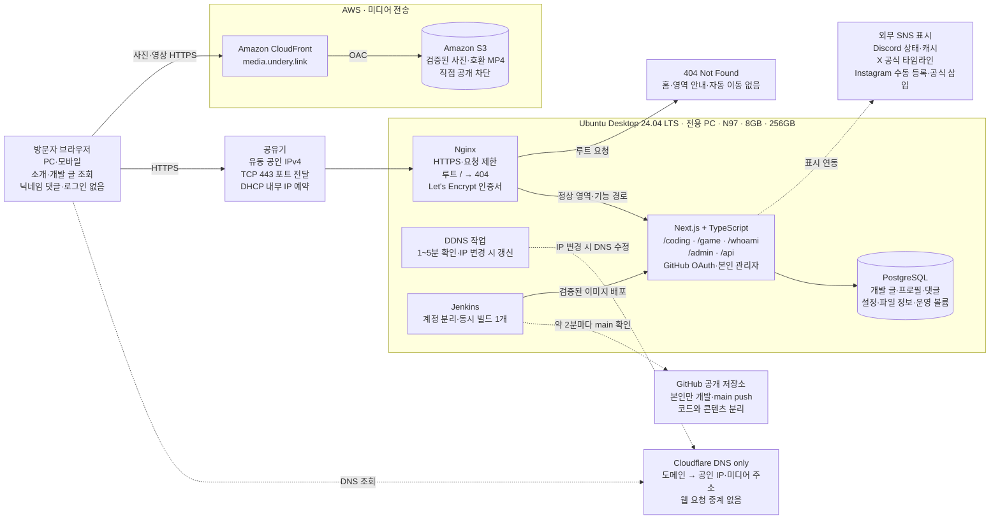
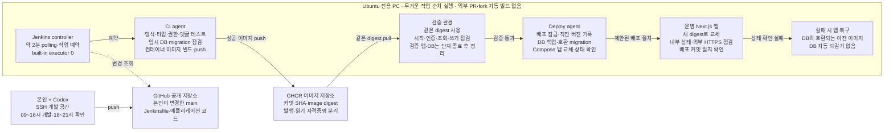
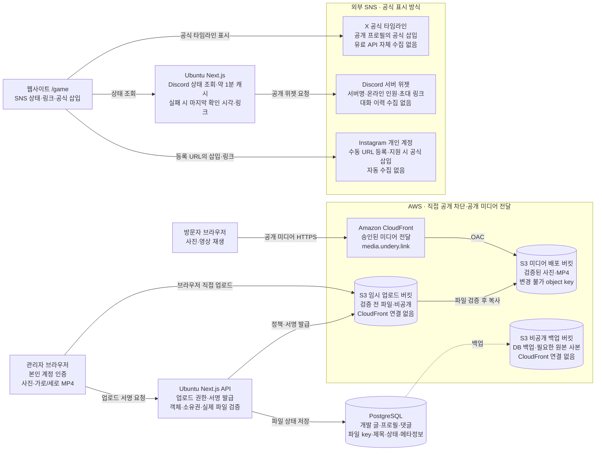

# 개인 웹사이트 구축·운영 보고서

> **구현 시작:** 실행 방법과 현재 완료 범위는 [첫 구현 기반](docs/FOUNDATION.md), 운영 전환은 [운영 안내](docs/OPERATIONS.md), 확인 결과는 [검증 기록](docs/VERIFICATION.md)을 참고하세요. 아래 계획 전체가 구현 완료되었다는 의미는 아닙니다.

**자기소개·개발 기록·게임 활동을 위한 서비스 설계**

개정 기준: 2026년 9월 26일 · 마감 날짜 없음 · 단계별 완료 기준 충족 후 공개

문서 범위: 요구사항 · 페이지 · 데이터·권한 · 인프라 · CI/CD · 운영·복구 · 단계·비용 · 검증 · 아키텍처

[같은 개정본의 PDF 보고서](Document/personal-website-plan.pdf)

## 목차

[보고서 개요](#overview)

[1. 구축 목표와 추진 조건](#section-01)

[2. 페이지와 정보 구조](#section-02)

[3. 콘텐츠와 방문자 기능](#section-03)

[4. 기술 구성](#section-04)

[5. DNS와 네트워크 구성](#section-05)

[6. Discord·X·Instagram 연동](#section-06)

[7. AWS 미디어 저장과 전송](#section-07)

[8. 데이터와 권한](#section-08)

[9. Ubuntu 운영과 복구](#section-09)

[10. Jenkins CI/CD 설계](#section-10)

[11. 추진 단계와 완료 기준](#section-11)

[12. 개발 수행과 검토 체계](#section-12)

[13. 비용 계획](#section-13)

[14. 공개 전 검증 항목](#section-14)

[15. 구축 기준과 착수 준비](#section-15)

[아키텍처 안내](#architecture)

[부록 A · 전체 운영 구조](#appendix-a)

[부록 B · Jenkins 자동 배포](#appendix-b)

[부록 C · 미디어·SNS 연결](#appendix-c)

## 보고서 개요

이 보고서는 개인 웹사이트의 구축 목표부터 화면·데이터 설계, 자동 배포, 운영·복구와 공개 검증까지 정의하는 구축 전 설계 문서입니다. 서비스는 `undery.link/coding`, `undery.link/game`, `undery.link/whoami`의 독립된 진입 경로로 구성하며 관리자는 본인 1명입니다. 방문자는 회원가입 없이 콘텐츠를 읽고 자기소개 페이지에 닉네임을 입력해 댓글을 남깁니다.

`/whoami`는 **자기소개 → 인적사항·성격 → 할 수 있는 것 → 장점·강점 → 댓글** 순서로 구성합니다. MBTI와 성격 요소는 본인이 입력하며 인적사항은 항목별로 공개 여부를 설정합니다. 실제 소개 내용·기술 숙련도·강점은 본인이 작성하고 확인한 내용만 공개합니다.

| 구분 | 구축·운영 기준 |
|---|---|
| 서비스 구성 | 코딩 `/coding`, 게임 `/game`, 자기소개 `/whoami`. 최상위 `/`는 404로 접근 차단 |
| 방문자 댓글 | `/whoami`에서 로그인·회원가입 없이 작성. 닉네임·본문 필수 |
| 운영 서버 | Ubuntu Desktop 24.04 LTS, 24시간 전용 운영 |
| 하드웨어 | Intel N97 4코어·4스레드, DDR5 8GB, NVMe SSD 256GB. 사용자 제공 사양 |
| 개발 환경 | 원격 작업·SSH를 사용하며 개발 계정·폴더와 운영 데이터를 분리 |
| 저장소·자동 배포 | 공개 GitHub 저장소, 본인만 개발, main 변경 → Jenkins 자동 배포 |
| 네트워크 | 공유기 제어·포트포워딩 가능. 공인 IPv4·CGNAT·외부 접속은 착수 전 실측 |
| DNS·미디어 | Cloudflare DNS only, AWS S3·CloudFront |
| SNS | Discord 서버 상태, X 공식 타임라인, Instagram 개인 계정·게시물/릴스 수동 등록 |
| 영상 | 가로 게임 영상·직접 촬영한 세로 영상, 호환 MP4(H.264/AAC). 자동 영상 변환 없음 |
| 작업 시간 | 개발 가능 09~16시, 본인 확인 18~21시. 한국 시간 |
| 예산·추진 기준 | AWS 월 3만원 이내 목표. 마감 날짜 없이 단계별 완료 기준을 통과한 뒤 공개 |

**적용 기준.** 필수 요구사항과 초기 구현 기본값을 구분합니다. 댓글의 즉시 공개, 닉네임 2~20자, 본문 1~1,000자, 제출 빈도와 미디어 용량 제한은 첫 운영을 위한 기본값이며 실제 사용성을 검증해 조정합니다. 서버 성능·외부 접속·서비스 표시 조건은 실측 전까지 보장하지 않습니다.

**자료와 검증 범위.** 기술 참고 자료는 본문에 공식 문서 링크로 표시합니다. 서비스 요금 예시는 2026년 9월 9일 계획 기준이며 계약·설치 시점에 지원 버전, 계정별 제공 조건과 실제 견적을 확인합니다. 이 보고서는 애플리케이션 구현, 서버 설치, 도메인 구매나 AWS 자원 생성의 완료 결과를 의미하지 않습니다.

## 1. 구축 목표와 추진 조건

한 개의 도메인 `undery.link` 아래 코딩 `/coding`, 게임 `/game`, 자기소개 `/whoami`를 각각 독립된 공개 영역으로 운영합니다. 최상위 홈페이지는 만들지 않으며 `undery.link` 또는 `undery.link/` 요청에는 404를 반환합니다. 본인이 관리자 화면에서 콘텐츠와 소개 정보를 관리하고, 방문자는 회원가입 없이 콘텐츠를 읽거나 `/whoami`에 닉네임을 입력해 공개 댓글을 남길 수 있도록 합니다.

첫 공개의 완성 기준은 실제 도메인 접속, 콘텐츠 관리, AWS 미디어 업로드·조회, GitHub main push 후 자동 배포, PC 재부팅과 데이터 복원까지 확인한 첫 공개 버전입니다.

- 추진 방식: 착수일·공개일·보완 종료일을 미리 정하지 않습니다. 각 단계의 완료 증거를 확인한 뒤 다음 단계로 진행하며, 전체 공개는 필수 검증 통과 후 결정합니다.
- 작업량: Jenkins 구성, 사이트 구현·미디어 연동·통합 검증에 약 80~105시간의 집중 작업을 계획상 추정치로 둡니다. `/whoami`와 댓글을 포함한 실제 작업량은 데이터·화면 설계 후 다시 산정합니다. 사용자의 저녁 검토 시간은 별도이며, 초기 설계·기반 구현 단계에서 실제 작업량을 다시 계산합니다. 이 수치는 완료 보장이 아닙니다.
- 권한: 관리자 1명. 일반 회원가입, 방문자 파일 업로드, 다중 작성자는 후속 범위로 둡니다.
- 운영: Ubuntu PC를 웹사이트 전용으로 24시간 운영합니다. 사용자 확인 완료. 공유기 설정과 포트포워딩이 가능하며 공인 IPv4·CGNAT은 착수 전 점검합니다.
- 디자인: 한국어 중심, 모바일 대응, 하나의 공통 디자인에 Coding·Game·Whoami별 강조색을 적용합니다.
- 서비스 역할: Cloudflare는 DNS only로 사용합니다. 앱·DB·Jenkins는 전용 Ubuntu PC에 배치하는 것을 기본안으로 확정하고, AWS는 월 3만원 이내에서 S3·CloudFront 중심으로 사용합니다. N97·8GB에서 최소 시험 빌드를 먼저 실행하고, 자원 부족 시 작업 동시성을 줄이는 것부터 적용합니다.
- 자동 배포: Jenkins가 GitHub main의 변경을 감지하고, 검사와 빌드에 성공한 버전을 자동 반영합니다. 평상시 운영 배포에 별도 수동 승인을 요구하지 않습니다. 한 번에 여러 커밋이 올라오면 최신 main을 기준으로 처리하는 기본안을 둡니다.
- SNS: Discord 상태·X 공식 타임라인과 Instagram 프로필 링크·수동 등록 게시물을 제공합니다. Instagram 자동 수집은 제공하지 않습니다. X 유료 API 수집도 사용하지 않습니다.
- 확장: Kubernetes, 별도 Spring 서버, 실시간 채팅, 자체 영상 변환 시스템은 첫 공개 이후 검토합니다.

## 2. 페이지와 정보 구조

최상위 홈페이지를 제공하지 않습니다. 외부 서비스에 웹페이지를 등록하거나 SNS 프로필·검색 등록·QR·공유 링크를 만들 때 해당 목적의 **전체 경로 주소**를 사용합니다. 게임은 `https://undery.link/game`, 코딩은 `https://undery.link/coding`, 자기소개는 `https://undery.link/whoami`로 직접 진입합니다.

| 주소 | 화면·응답 | 첫 공개 기능 |
|---|---|---|
| `/` | 404 Not Found | 메인·프로필 요약·영역 목록·자동 이동을 제공하지 않음 |
| `/coding` | 코딩 글 목록 | 4개 분류, 태그, 제목 검색, 페이지 나누기 |
| `/coding/[slug]` | 코딩 글 상세 | 본문, 코드 강조, 작성·수정일, 분류와 태그 |
| `/game` | 게임 활동 홈 | Discord 서버 상태·초대 링크, 게임별 ID, X 타임라인, 수동 등록 Instagram 게시물, 최근 미디어 |
| `/game/highlights` | 하이라이트 | 관리자 영상 업로드, 제목·게임명·설명, 썸네일과 재생 |
| `/game/gallery` | 사진첩 | 관리자 이미지 업로드, 설명, 확대 보기 |
| `/whoami` | 자기소개 | 자기소개, 인적사항·MBTI 등 성격 요소, 할 수 있는 것, 장점·강점, 닉네임 댓글 |
| `/admin` | 관리자 | 로그인, 개발 글·미디어·소개 정보 관리, 댓글 조회·숨김·삭제 |
| `/privacy` | 공통 데이터 처리 안내 | 닉네임 댓글의 공개 범위, 로그·보관 기간, 외부 서비스 사용, 삭제 방법·문의 |

API는 같은 도메인의 `/api/...` 아래 둡니다. 별도 `api` 도메인은 첫 공개에 필요하지 않습니다. 댓글은 `/whoami` 페이지 하단에만 제공하며 개발 글·게임 페이지별 댓글로 확대하지 않습니다. `/admin`·`/api`·`/privacy`는 기능 수행을 위한 공통 경로이며 방문자용 통합 홈이나 다른 영역의 목록을 제공하지 않습니다.

### 영역별 등록·이동·노출 규칙

| 진입 주소 | 메뉴·로고·목록으로 이동 | 표시 범위 |
|---|---|---|
| `https://undery.link/game` | 게임 홈, 하이라이트, 사진첩. 모두 `/game` 내부 | 게임 ID·게임 미디어·게임 SNS |
| `https://undery.link/coding` | 코딩 글 목록, 분류, 태그, 글 상세. 모두 `/coding` 내부 | 개발 글·코딩 관련 외부 계정 링크 |
| `https://undery.link/whoami` | 다섯 소개 섹션의 앵커. 모두 `/whoami` 내부 | 소개·인적사항·성격·역량·강점·댓글 |

- Home·Coding·Game·Whoami를 함께 보여주는 전역 메뉴와 통합 랜딩 페이지를 만들지 않습니다. 로고·홈 버튼·모바일 메뉴·푸터·오류 화면의 돌아가기 링크는 현재 영역의 시작 주소를 사용합니다. 루트 `/`로 연결하지 않습니다.
- 각 영역의 추천 콘텐츠·검색·최근 글·브레드크럼은 같은 영역의 콘텐츠만 조회합니다. 자기소개 근거 링크도 다른 내부 영역으로 자동 연결하지 않고 설명 또는 필요한 외부 공개 프로젝트 링크로 제공합니다.
- 공유 제목·설명·대표 이미지와 canonical은 실제 영역 또는 상세 페이지 주소를 사용합니다. 루트 주소를 대표 URL로 등록하지 않습니다.
- 검색 제출용 사이트맵은 `/game/sitemap.xml`, `/coding/sitemap.xml`, `/whoami/sitemap.xml`로 나누고 각 파일에는 해당 영역의 공개 주소만 포함합니다. 루트·관리자·초안·비지원 경로를 제외하고, 통합 사이트맵·전체 영역 안내 페이지를 제공하지 않습니다. `robots.txt`는 최소 크롤링 안내만 제공하며 영역 목록을 모으는 용도로 사용하지 않습니다.
- `/privacy`는 각 영역에서 공통 안내로 연결할 수 있습니다. 해당 안내 자체에는 다른 영역의 탐색 메뉴를 넣지 않습니다. 관리자 로그인 완료·로그아웃 후 목적지는 `/admin`의 적절한 로그인/관리 화면으로 정하고 `/`를 기본값으로 사용하지 않습니다.

여기서 “해당 페이지에서만 본다”는 **등록한 경로의 콘텐츠와 메뉴를 분리한다**는 뜻입니다. 공개된 다른 경로를 직접 입력하는 사람까지 구분해 차단하는 회원·초대 권한 기능은 포함하지 않습니다. 경로를 알고 있는 방문자는 각 공개 영역에 직접 접속할 수 있으며, Referer·검색 노출 제외·숨긴 링크를 접근 권한으로 사용하지 않습니다.

### 루트 접근 차단과 비정상 주소

`https://undery.link`와 `https://undery.link/`는 같은 루트 요청으로 취급하고 실제 HTTP 404를 반환합니다. 빈 화면을 200으로 보내거나 `/game`·`/whoami`로 자동 이동하지 않습니다. 오류 응답에는 프로필·다른 영역 목록·홈 이동 링크가 없습니다. 쿼리가 붙은 `/?from=profile`, 루트 해시 주소 `/#game`, `/index.html`·`/index` 등 우회 진입에서도 통합 홈을 노출하지 않습니다.

HTTP와 `www.undery.link`의 루트에도 같은 정책을 적용합니다. 정상 영역 경로만 경로·쿼리를 보존해 HTTPS의 `undery.link` 주소로 정규화합니다. 후행 슬래시를 정리하더라도 `/game/`가 `/`로 바뀌면 안 됩니다. 알 수 없는 경로는 404이며 루트로 되돌리는 catch-all·SPA fallback을 두지 않습니다.

기존 개발 경로 `/develop`은 `/coding`으로 변경합니다. 첫 구축에서 `/develop` 및 하위 경로는 404로 처리합니다. 이미 배포·공유한 주소가 확인된 경우에만 읽기용 GET·HEAD에 대해 `/develop` → `/coding`, `/develop/[slug]` → 같은 글의 `/coding/[slug]` 이동을 추가합니다. 기존 쓰기 API를 자동 리디렉션하지 않습니다.

### `/whoami`의 다섯 섹션

| 순서·이동 위치 | 섹션 | 표시 내용·관리 방식 |
|---|---|---|
| 1 · `#intro` | 자기소개 | 표시 이름, 프로필 이미지, 한 줄 소개, 소개 본문, 관심 분야·목표. 소개 정보는 이 영역에서만 표시 |
| 2 · `#profile` | 인적사항·성격 | 활동명, 하는 일·관심 분야, 선택 공개 인적사항, MBTI, 성격 키워드, 소통·작업 스타일 |
| 3 · `#skills` | 할 수 있는 것 | 기술·도구 이름보다 실제 수행할 수 있는 작업을 설명. 수행 수준과 관련 글·프로젝트 근거 링크 |
| 4 · `#strengths` | 장점·강점 | 강점 제목, 구체적 행동·경험, 근거 또는 관련 글·프로젝트 링크 |
| 5 · `#comments` | 댓글 | 로그인 없는 닉네임·본문 작성 폼, 공개 댓글 목록, 작성 시각, 본인 댓글 삭제 진입 |

상단의 섹션 이동 링크는 `/whoami#intro`부터 `/whoami#comments`까지 연결합니다. 별도 하위 페이지를 만들지 않습니다. 모바일에서도 위 순서를 유지하고 키보드로 링크·입력 폼을 사용할 수 있도록 합니다. 댓글이 없으면 빈 상태 안내와 작성 폼을 표시합니다.

메뉴는 각 영역 내부 이동으로 한정하고 통합 메뉴를 제공하지 않습니다. `/whoami`의 공유 제목·설명·대표 이미지를 설정하고 canonical은 `/whoami`로 둡니다. 비공개 인적사항은 공유 메타데이터와 구조화 데이터에도 넣지 않습니다.

### 제공 범위와 비지원 경로

일상 블로그, 하루 한 문장, 비공개 메시지, Q&A는 제공 범위에 포함하지 않습니다. `/blog`, `/blog/daily`, `/blog/message`, `/blog/qa`와 관련 API·관리자 메뉴·데이터 모델을 생성하지 않으며 메뉴·사이트맵·검색 대상에서도 제외합니다.

첫 구축에서는 지원하지 않는 경로를 404로 처리합니다. 이미 외부에 공개된 주소가 있는 경우에만 `/blog`의 GET을 `/whoami`로 영구 이동하고, 기존 하위 페이지에는 기능 종료 안내와 `/whoami` 링크를 제공합니다. 기존 작성 API는 410으로 거절하며 공개 댓글 API로 자동 전달하지 않습니다.

기존 운영 데이터가 실제로 존재한다면 백업·보관 범위 확인 후 별도 migration으로 정리합니다. 비공개 메시지와 미공개 질문을 공개 댓글로 자동 이전하거나 본문을 노출하지 않습니다. 데이터 정리는 실제 운영 여부와 보관 범위를 확인한 뒤 별도 작업으로 수행합니다.

### 코딩 분류와 영역 내부 이동

개발 글 분류는 다음과 같이 고정하고 세부 기술은 태그로 관리합니다.

| 분류 | 태그 예시 |
|---|---|
| 서버·인프라 | Linux, Kubernetes, Docker |
| 프론트엔드·백엔드 | React, Node.js, Spring, MySQL |
| 네트워크 | HTTPS, DNS, DHCP |
| 프로그래밍·기타 | C, C++, Python |

개발 페이지의 footer에는 GitHub, Docker Hub 등 실제 본인 계정 링크를 배치합니다. 코딩 메뉴와 로고는 `/coding`으로 연결하고, 다른 영역이나 루트로 이동하는 전역 내비게이션은 제공하지 않습니다. 모바일에서는 메뉴와 글 읽기 흐름을 우선하고 영상은 자동 재생하지 않습니다.

## 3. 콘텐츠와 방문자 기능

### 개발 글

- 관리자가 웹에서 작성·수정·삭제하고 초안과 공개 상태를 구분합니다.
- 개발 글 편집기는 Markdown 입력과 미리보기를 기본으로 합니다. 복잡한 서식 편집기 제작은 후순위입니다.
- 사용자 입력으로 스크립트나 실행 가능한 MDX를 실행하지 않습니다. 출력할 HTML과 링크 형식을 제한합니다.
- 개발 글 검색은 제목·태그 중심으로 시작합니다. 외부 검색 서버는 두지 않습니다.

### 자기소개·인적사항·성격

`/whoami`는 게시글 목록이 아니라 한 사람의 소개 정보를 모아 보여주는 단일 페이지입니다. 관리자 화면에서 네 개의 소개 섹션을 편집하고 미리보기 후 공개합니다. 방문자 댓글은 별도 데이터로 관리하며 소개 정보를 수정해도 지워지지 않습니다.

| 항목 | 입력·공개 원칙 |
|---|---|
| 자기소개 | 표시 이름, 한 줄 소개, 소개 본문, 관심 분야·목표. 실제 문장은 본인이 작성·확인 |
| 기본 인적사항 | 활동명과 하는 일 등을 입력. 생년월일·지역·소속 등은 선택 입력하고 항목별 공개 여부를 관리 |
| MBTI | 본인이 입력한 유형 또는 미입력 상태를 저장. 임의 추정하거나 기본 유형을 채우지 않음 |
| 성격 요소 | 본인이 고른 성격 키워드, 소통 방식, 일하는 방식 등을 짧은 설명으로 표시 |
| 민감한 공개 범위 | 상세 주소·개인 전화번호·비공개 이메일을 필수 항목으로 두지 않음. 생년월일·지역 등 선택 인적사항은 최초 비공개 |
| 미입력·미확정 값 | 임의 정보로 채우지 않고 해당 항목을 숨기거나 준비 중 안내. 공개 전에는 실제 표시할 문구를 확인 |

MBTI·성격 키워드는 자기 설명용 정보로만 다루며 실제 기술 역량을 판정하는 기준으로 사용하지 않습니다. 프로필 값의 공개 여부는 서버 응답·HTML·API·캐시·공유 데이터에 동일하게 적용합니다. 화면에서만 숨긴 채 응답에 포함하지 않습니다.

관리자 편집은 초안과 공개본을 분리합니다. 저장 중인 초안은 방문자에게 보이지 않고 공개 동작 후 `/whoami`의 공개본·공유 정보·캐시가 갱신됩니다. 루트에는 소개 요약을 생성하지 않습니다. 콘텐츠 수정은 운영 DB 변경으로 반영하며 앱 재빌드나 Jenkins 배포를 요구하지 않습니다.

### 할 수 있는 것

기술명을 나열하는 것보다 “어떤 작업을 어느 수준까지 수행할 수 있는지”를 보여줍니다. 각 항목은 분야·기술/도구·가능한 작업·수행 수준·근거 링크·표시 순서·공개 여부로 구성합니다.

초기 입력 분류는 서버·시스템, 클라우드·인프라, 개발·자동화 등으로 제안합니다. 수행 수준은 `직접 수행 가능`, `실습 경험`, `학습 중`처럼 의미를 설명할 수 있는 표현을 사용합니다. 기술명과 분류는 콘텐츠 작성을 위한 입력 예시이며 본인의 실제 보유 역량을 확정하는 내용이 아닙니다.

근거는 설명과 공개 GitHub 프로젝트 등의 외부 링크로 제공합니다. 다른 내부 영역인 `/coding/[slug]`로 유도하는 추천·바로가기 메뉴는 제공하지 않습니다. 확인하지 않은 경력·자격증·성과 수치나 임의의 숙련도 백분율을 넣지 않습니다. 근거 링크는 선택 항목이지만 입력한 링크의 공개·유효 여부는 확인합니다.

### 장점·강점

강점은 제목과 짧은 설명만 나열하지 않고 실제 행동·경험을 함께 적습니다. 각 항목은 강점 제목, 설명, 행동 또는 사례, 선택 근거 링크, 표시 순서, 공개 여부로 관리합니다.

작성 형식은 `[강점 제목] → [그 강점이 드러난 행동] → [본인이 확인한 사례 또는 결과]`를 기본으로 합니다. 실제 장점과 성격을 문서 작성자가 추정하지 않으며 본인이 입력·확인한 항목만 공개합니다. 성격 섹션은 “어떤 사람인지”를, 강점 섹션은 “일하거나 문제를 해결할 때 어떤 도움이 되는지”를 설명하도록 구분합니다.

### 로그인 없는 닉네임 댓글

댓글의 필수 요구사항은 **로그인·회원가입 없이 작성**하고 **닉네임을 반드시 입력**하는 것입니다. 댓글 본문도 필수입니다. 실명·이메일·방문자 계정은 요구하지 않습니다. 아래 공개 방식·제한·삭제 절차는 첫 구현을 위한 기본값입니다.

| 항목 | 초기 구현 기본값 |
|---|---|
| 작성 위치 | `/whoami#comments`의 닉네임·댓글 본문 폼 |
| 닉네임 | 앞뒤 공백 정리 후 2~20자. 공백뿐인 값 거절. 자동으로 “익명”을 채워 통과시키지 않음 |
| 본문 | 앞뒤 공백 정리 후 1~1,000자. 일반 텍스트와 줄바꿈만 표시. HTML·Markdown·이미지·파일 업로드 미지원 |
| 공개 방식 | 서버 검증 통과 → 저장 → 즉시 공개 목록 반영. 사전 승인·비공개 받은편지함·별도 Q&A 흐름 없음 |
| 표시 정보 | 닉네임, 본문, 작성 시각. 최신순으로 초기 20개씩 페이지 나누기. 시각은 한국 시간으로 표시 |
| 관리자 기능 | 관리자 로그인 후 전체 상태 조회, 숨김·다시 공개·삭제. 숨김 댓글은 공개 화면·API에서 제외 |
| 작성자 삭제 | 제출 성공 시 삭제용 무작위 비밀코드를 한 번 표시. 댓글 ID와 코드를 제출하면 로그인 없이 본인 댓글 삭제 |
| 제외 범위 | 방문자 로그인, 회원가입, 이메일 인증, 대댓글, 반응·좋아요, 방문자 본문 수정, 개인 답변 알림 |

닉네임은 표시용이며 본인 인증이나 고유 계정이 아닙니다. 같은 닉네임을 허용하되 기존 댓글에 대한 권한을 부여하지 않습니다. 관리자 표시·권한은 방문자가 입력한 닉네임이나 클라이언트의 역할 값으로 생성하지 않습니다. 작성 시 “닉네임과 댓글 내용이 공개됩니다. 개인정보를 입력하지 마십시오.”라는 안내를 제공합니다.

닉네임·본문의 타입·길이·공백 여부·허용 형식은 서버에서 검증합니다. 클라이언트의 글자 수 안내와 동일한 계산 규칙을 사용합니다. 화면에서는 댓글을 실행 가능한 HTML로 해석하지 않고 텍스트로 출력합니다. 입력 검증만으로 출력 안전성을 대체하지 않습니다. 보안 참고: [OWASP 입력 검증](https://cheatsheetseries.owasp.org/cheatsheets/Input_Validation_Cheat_Sheet.html), [OWASP XSS 예방](https://cheatsheetseries.owasp.org/cheatsheets/Cross_Site_Scripting_Prevention_Cheat_Sheet.html).

서버 제출 빈도 제한, 숨김 함정 입력, 요청 크기 제한, 중복 저장 방지를 적용합니다. 초기 제한은 동일 보안 식별 기준 30초당 1회·10분당 5회를 제안하며 공유 회선과 실제 사용성을 보고 조정합니다. 제한 초과·검증 실패·서버 오류는 구분해 안내하고 재시도 시 폼 내용을 보존합니다. 중복 요청의 재전송으로 댓글이 여러 번 생성되지 않도록 처리합니다.

삭제코드는 서버에서 충분히 긴 무작위 값으로 발급하고 DB에는 해시만 저장합니다. 코드 원문을 URL·앱 로그·공개 API에 포함하지 않습니다. 닉네임이 같다는 이유로 삭제를 허용하지 않으며 코드 검증·삭제 요청에도 별도 빈도 제한을 적용합니다. 코드를 잃은 경우 별도 문의를 받고 관리자가 확인합니다. 댓글 삭제·숨김 시 공개 목록과 캐시도 갱신합니다.

로그인 없는 작성은 접속 로그까지 남지 않는 완전한 익명성을 뜻하지 않습니다. 보안용 식별정보는 댓글 공개 데이터와 분리하고 목적·보관 기간을 `/privacy`에 안내합니다. 앱·프록시 로그에 댓글 본문·삭제코드를 기록하지 않습니다. 보안 로그 7일, 삭제 데이터의 백업 잔존 최대 30일을 초기 운영안으로 두며 실제 백업 정책과 맞춰 확정합니다.

### 관리자 화면과 댓글 API

관리자 메뉴는 개발 글, 미디어, Whoami 소개 정보, 댓글 관리, SNS 설정으로 구성합니다. Whoami 소개 정보에서는 네 개의 소개 섹션과 필드별 공개 여부·표시 순서를 편집합니다. 댓글 관리에서는 공개·숨김 상태를 구분하고 내용·작성 시각을 확인해 숨김·다시 공개·삭제합니다.

| API 경로·메서드 | 접근 | 허용 범위 |
|---|---|---|
| `GET /api/whoami` | 로그인 불필요 | 공개본과 공개 필드만 반환. 미공개 소개·비공개 인적사항 제외 |
| `GET /api/whoami/comments` | 로그인 불필요 | 공개 댓글의 ID·닉네임·본문·작성 시각만 페이지 단위 조회 |
| `POST /api/whoami/comments` | 로그인 불필요 | 닉네임·본문 검증 후 작성. 공개 상태는 서버가 결정 |
| `POST /api/whoami/comments/[id]/delete` | 로그인 불필요 | 요청 본문의 삭제코드를 검증한 해당 댓글만 삭제 |
| `GET/PATCH /api/admin/whoami` | 관리자만 | 소개 초안·공개본 조회·편집·공개 전환 |
| `GET /api/admin/whoami/comments` | 관리자만 | 공개·숨김 상태를 포함한 관리용 목록 조회 |
| `PATCH/DELETE /api/admin/whoami/comments/[id]` | 관리자만 | 지정 댓글 숨김·다시 공개·삭제 |

서버는 요청에서 허용한 필드만 받으며 방문자가 공개 상태·관리자 역할·삭제코드 해시를 지정하지 못하게 합니다. 제출·삭제·관리자 응답은 공개 캐시에 저장하지 않습니다. 숨김·삭제·비공개 정보가 검색 결과나 공유 응답으로 노출되지 않는지 함께 검사합니다.

## 4. 기술 구성

| 역할 | 권장안 | 선택 이유 |
|---|---|---|
| 화면과 서버 기능 | Next.js + TypeScript | React 화면과 게시글·관리자·API를 한 프로젝트에서 관리 |
| 데이터베이스 | PostgreSQL | 개발 글·소개 정보·댓글·상태 관리, 일관된 백업 |
| 데이터 접근 | Prisma 등 한 가지 도구 | 데이터 구조 변경을 기록하고 반복 적용 |
| 관리자 인증 | 검증된 인증 라이브러리 + GitHub OAuth | 본인 GitHub 계정 ID만 관리자로 허용 |
| 실행 환경 | Ubuntu 24.04 + Docker Engine + Compose | 앱·DB 실행과 서비스별 재시작 |
| 웹 진입점·HTTPS | Nginx + Let's Encrypt | 직접 외부 접속, HTTPS, 요청 제한 |
| 도메인·DNS | Cloudflare DNS only | 웹사이트 주소와 미디어 주소 지정 |
| 유동 공인 IP 갱신 | DDNS 작업 → Cloudflare DNS API | 공인 IP 변경 시 A 레코드 자동 수정 |
| 이미지·영상 원본 | Amazon S3 | 파일과 배포 코드를 분리 |
| 미디어 전송 | Amazon CloudFront + S3 OAC | 비공개 S3 원본을 CDN을 통해 제공 |
| 미디어 도메인 인증서 | AWS Certificate Manager | CloudFront의 media 도메인 HTTPS |
| 영상 처리 | 호환 MP4 업로드·검증, 자동 변환 없음 | N97·8GB 자원과 첫 공개 범위·AWS 비용 관리 |
| 자동 입력 방지 | 서버 제출 제한 + 숨김 함정 입력·중복 방지 | 로그인 없는 닉네임 댓글의 자동·반복 제출 억제 |
| CI | Jenkins LTS + 빌드 전용 agent | 코드 검사·테스트·컨테이너 빌드 |
| 이미지 보관 | GitHub Container Registry(GHCR) | 커밋별 실행 이미지 배포·복구 |
| CD | Jenkins 배포 전용 agent + 제한된 배포 절차 | 검사에 통과한 이미지를 자동 설치·점검 |

Cloudflare Tunnel, R2, Stream, Turnstile과 Cloudflare HTTP 프록시는 본 구축 범위에서 제외합니다. Cloudflare와 Amazon CloudFront는 서로 다른 서비스입니다. CloudFront는 AWS에서 이미지·영상 전송을 담당합니다.

프레임워크와 Node.js LTS의 구체적인 버전은 착수일의 지원·호환성을 확인한 뒤 고정합니다. Next.js의 자체 호스팅에는 reverse proxy를 앞에 둡니다. [Next.js 자체 호스팅](https://nextjs.org/docs/app/guides/self-hosting)

Ubuntu 24.04는 Docker Engine 지원 대상이며 서버에는 Engine과 Compose를 사용합니다. [Docker Ubuntu 지원](https://docs.docker.com/engine/install/ubuntu/)

React·Spring·MySQL 등은 게시글의 주제와 사이트 구현 기술을 구분합니다. MySQL에 더 익숙하다면 DB를 MySQL로 교체할 수 있으나, 처음에는 한 종류만 운영합니다.

## 5. DNS와 네트워크 구성

Cloudflare DNS는 도메인을 접속할 주소에 연결합니다. DNS only에서는 웹 요청을 중계하지 않고 원본 주소를 알려주므로, 외부 접속 가능성·웹 서버 HTTPS·방화벽을 별도로 구성해야 합니다. [Cloudflare 프록시와 DNS only](https://developers.cloudflare.com/dns/proxy-status/)

### 기본안: 공인 IPv4가 있고 포트 전달이 가능한 경우

방문자 → 도메인의 공인 IP 조회 → 공유기 → Ubuntu Nginx → 앱 순서로 접속합니다. 미디어는 AWS CloudFront로 직접 요청합니다.

도식은 [부록 A · 전체 운영 구조](#appendix-a)를 참조합니다.

| 확인·구성 항목 | 계획 |
|---|---|
| 내부 IP | 공유기 DHCP 예약으로 Ubuntu의 내부 주소를 일정하게 유지 |
| 공인 IP | 공유기 WAN 주소와 외부에서 관측한 주소를 비교하고 외부 접속 실측 |
| 포트 전달 | TCP 443을 Ubuntu Nginx로 전달. HTTP→HTTPS 이동을 제공하면 80도 구성 |
| DDNS | 부팅·회선 재연결 및 약 1~5분 주기로 공인 IPv4 확인, 바뀔 때만 DNS API 호출 |
| DNS 레코드 | 대표 주소 A 레코드를 공인 IPv4로 설정하고 프록시 비활성화 |
| DNS TTL | 300초 등 짧은 초기값을 적용하고 실제 반영 시간을 점검 |
| IPv6 | 외부 접속을 검증한 경우에만 AAAA 사용. 잘못된 AAAA 레코드를 남기지 않음 |
| 인증서 | Ubuntu에 브라우저가 신뢰하는 Let's Encrypt 인증서 발급·자동 갱신 |
| 장애 감지 | DDNS 실패·인증서 만료 임박·사이트 외부 접근 실패를 확인 |

공인 IP 변화를 감지해 Cloudflare API로 레코드를 갱신하는 방식은 공식적으로 안내되어 있습니다. DNS 변경 감지 주기와 캐시 만료 때문에 IP 변경 직후에는 접속 중단이 생길 수 있으며, 무중단 전환으로 보장하지 않습니다. [Cloudflare DDNS 안내](https://developers.cloudflare.com/dns/manage-dns-records/how-to/managing-dynamic-ip-addresses/)

DDNS가 실패하거나 IP 확인 결과가 비정상이면 기존 DNS를 유지합니다. DNS API 권한은 해당 zone의 DNS 관리에 한정하고 비밀값은 서버에 보관합니다. IP를 변경할 때마다 웹사이트를 다시 빌드할 필요는 없습니다.

인증서는 DNS-01 검증과 Cloudflare DNS API 연동을 우선 검토합니다. DNS 검증은 인증서 발급 방법이며 외부 443 포트 접속을 대신 해결하지 않습니다. 자동 갱신과 Nginx 인증서 재적용도 점검합니다. [Let's Encrypt 검증 방식](https://letsencrypt.org/docs/challenge-types/)

### CGNAT·외부 포트 차단·회선 이동

DDNS는 CGNAT나 공유기 설정 권한 부족을 해결하지 않습니다. 공유기 WAN 주소가 사설 주소 또는 100.64.0.0/10 범위인지, 외부 관측 주소와 다른지 확인하되 최종 판단은 회선 정보와 외부 접속 시험으로 합니다. 이중 NAT는 상위 공유기까지 구성할 수 있는지 확인합니다.

| 조건 | 선택할 구성 | 비용·운영 영향 |
|---|---|---|
| 공개 공인 IPv4 + 공유기 제어 가능 | 기본안인 DDNS + 포트 전달 | 추가 중계 서버 비용 없음, 회선 이동 시 재설정 |
| CGNAT이지만 통신사가 공인 IP 제공 가능 | 회선 변경 후 기본안 | 제공 조건·추가 비용 확인 |
| CGNAT 또는 여러 회선 이동, Ubuntu 운영 유지 | EC2 + Elastic IP에 HTTPS 프록시, Ubuntu→EC2 VPN 연결 | EC2·IPv4·트래픽 비용, VPN 유지·복구 관리 추가 |
| PC 상시 실행 불가 | 앱·DB 운영을 EC2 등으로 이전 | Ubuntu는 개발용으로 사용, 원래 호스팅 범위 변경 |

AWS 중계 대안에서는 방문자 → EC2의 고정 주소·Nginx → 사설 VPN → Ubuntu 앱 순으로 연결합니다. Ubuntu가 WireGuard 등으로 외부 연결을 시작하고 재연결·keepalive를 유지하도록 설계합니다. 이동한 회선에서 VPN 통신이 허용되는지 먼저 검증합니다. EC2만 추가하고 VPN·프록시를 구성하지 않으면 집 PC에 연결되지 않습니다.

Elastic IP는 AWS 리소스에 연결하는 고정 공인 IPv4이며, 집 PC에 직접 부여하는 주소가 아닙니다. 할당·사용 시 IPv4 비용이 발생합니다. [AWS Elastic IP](https://docs.aws.amazon.com/AWSEC2/latest/UserGuide/elastic-ip-addresses-eip.html)

공유기 설정·포트포워딩은 가능하다는 답변을 받았으므로 DDNS 직접 접속을 우선 준비합니다. 다만 공인 IPv4·CGNAT 검증 전에는 외부 접속이 된다고 확정하지 않습니다. 통신사에 공인 IP 제공이 가능한지 먼저 확인하고, AWS 중계가 필요하면 월 3만원 예산에 미디어와 중계 비용을 함께 넣어 다시 견적·범위를 결정합니다. 중계 서버를 자동 추가하지 않습니다. 인터넷·전원이 끊긴 Ubuntu의 앱은 AWS 미디어 저장이나 중계 서버만으로 계속 운영되지 않습니다.

### 실제 도메인 배치

| 주소 | Cloudflare DNS only 설정·역할 |
|---|---|
| undery.link | 기본안에서는 집 공인 IPv4 A 레코드, 중계안에서는 EC2 Elastic IP. DNS는 유지하고 HTTP 루트만 404 |
| www.undery.link | 사용할 경우 DNS·인증서를 함께 구성. 루트는 404, 정상 영역은 경로를 보존해 undery.link로 이동 |
| staging.undery.link | 제한된 검증용 호스트, 실제 선택한 서버 주소에 연결 |
| media.undery.link | CloudFront 배포 도메인에 CNAME |
| ACM 검증 레코드 | AWS가 발급한 인증서 DNS 검증 CNAME을 유지 |

각 페이지 경로를 위해 별도 도메인이나 wildcard DNS는 필요하지 않습니다. 사이트와 미디어 HTTPS 인증서를 각각 구성합니다. CloudFront의 사용자 도메인 인증서는 ACM의 us-east-1에서 발급하고 해당 도메인을 배포에 등록합니다. S3 저장 리전은 서울을 우선 검토하며 인증서 리전과 구분합니다. [CloudFront 인증서 요구사항](https://docs.aws.amazon.com/AmazonCloudFront/latest/DeveloperGuide/cnames-and-https-requirements.html)

사용할 도메인은 `undery.link`입니다. 소유·갱신 상태와 DNS 관리 권한을 확인하고 네임서버를 Cloudflare로 지정합니다. Route 53을 추가로 도입할 필요는 없습니다. 로그인 callback, 쿠키, 업로드 CORS는 실제 도메인에 맞춰 설정합니다. 경로별 등록은 DNS 레코드를 따로 만드는 작업이 아니라 앱의 페이지 경로와 외부 등록 URL을 구분하는 작업입니다.

### Nginx·앱의 경로 처리 계획

루트 차단은 DNS 삭제나 도메인 전체 방화벽 차단으로 구현하지 않습니다. DNS와 HTTPS를 유지해야 `/game`·`/coding`·`/whoami`도 접속됩니다. Nginx의 루트 정확 일치 경로(`location = /`)에서 `return 404`를 적용하고, Next.js의 루트 역시 서버에서 404를 반환하며 콘텐츠·리디렉션을 두지 않습니다. [Nginx location](https://nginx.org/en/docs/http/ngx_http_core_module.html#location), [Nginx return](https://nginx.org/en/docs/http/ngx_http_rewrite_module.html#return)

HTTP·HTTPS·선택한 www 서버 설정에 모두 같은 루트 정책을 적용합니다. 서버 전체의 무조건 리디렉션이 루트 처리보다 먼저 실행되지 않도록 정상 경로의 HTTPS/대표 호스트 이동과 루트 거절을 분리합니다. 앱의 직접 포트는 외부에 공개하지 않으며, 루트 거절 오류를 앱의 홈 HTML로 바꾸는 `error_page` 또는 fallback을 구성하지 않습니다.

방문자 화면 외에 인증 callback, 필요한 `/api/...`, `/_next/...`, favicon·정적 파일, 영역별 사이트맵·`robots.txt`는 정상 기능에 필요한 경로로 따로 관리합니다. 경로 접두사가 비슷한 `/game-other`나 정의하지 않은 하위 경로가 정상 페이지로 통과하지 않도록 앱에서 경로 존재 여부를 검사합니다. 관리자/API 권한과 정적 자원 접근은 각각의 원래 정책을 유지합니다.

모니터링은 `/`의 200 응답을 기대하지 않습니다. 외부에서는 세 영역의 정상 응답과 루트의 예상된 404를 함께 검사하고, 내부 health check는 공개 콘텐츠와 분리된 상태 확인 경로를 사용합니다. 루트가 200 또는 영역 리디렉션으로 바뀌면 정책 위반으로 판단합니다.

## 6. Discord·X·Instagram 연동

본인이 운영하는 Discord 서버와 X·Instagram 계정을 소개합니다. X는 공식 타임라인을 사용하며 Instagram은 개인 계정과 수동 등록 방식으로 운영합니다.

| 서비스 | 첫 공개 구현 | 갱신 방식 |
|---|---|---|
| Discord | 서버명·온라인 인원·초대 링크 | 공식 서버 위젯의 공개 정보, 약 1분 캐시 |
| X | 본인 공개 프로필의 공식 타임라인·원문 이동 | 게시물 URL을 매번 등록하지 않고 X 위젯이 내용을 표시 |
| Instagram | 프로필 링크, 관리자가 선택한 게시물·릴스 URL 등록 | 수동 추가·수정·삭제, 지원되는 공개 게시물만 공식 삽입 방식으로 표시 |
| 직접 올린 미디어 | 사진·게임 영상·직접 촬영한 세로 영상 | 관리자 S3 업로드 후 공개 |

SNS 표시 설정과 게시물 추가는 관리자 화면에서 바꾸며 앱 재빌드나 Jenkins 배포를 요구하지 않습니다.

### Discord 서버 상태

서버 설정에서 위젯을 활성화하고, 공개할 정보와 초대 링크를 확인합니다. 온라인 인원은 공식 위젯의 `presence_count`를 사용합니다. 위젯의 사용자 목록은 최대 100명으로 제한되므로 목록 길이를 전체 온라인 인원으로 계산하지 않습니다. 첫 화면에는 서버명·온라인 인원·참여 버튼을 우선 표시합니다. [Discord Guild Widget 공식 문서](https://docs.discord.com/developers/resources/guild)

약 1분 캐시는 프로젝트의 초기 설정입니다. 요청 실패 시 “상태를 불러오지 못했습니다”와 마지막 확인 시각·초대 링크를 표시하며 온라인 0명과 구분합니다. 서버 활동 상태 표시에 채널 대화 이력 공개 기능은 포함하지 않습니다.

### X 공식 타임라인

공개 프로필 URL로 X 공식 타임라인을 등록합니다. 프로필·목록 타임라인은 공개 게시물을 표시하며 비공개 게시물은 지원하지 않습니다. [X 타임라인 공식 안내](https://help.x.com/en/using-x/embed-x-feed)

X 연동은 공식 타임라인 방식으로 구성합니다. X API로 본문을 자체 DB에 저장하거나 모든 신규 글의 빠짐없는 수집·시간순 정렬·고정된 갱신 시간을 보장하는 범위는 아닙니다. X 위젯의 표시 정책, 브라우저 차단, 로그인 상태에 따른 실제 노출은 착수 초반에 확인합니다. 위젯이 실패해도 본인 X 프로필 링크를 항상 제공합니다.

X API의 사용량 과금은 비용 검토 대상이며 별도 유료 피드 수집은 구성하지 않습니다. [X API 요금 방식](https://docs.x.com/x-api/getting-started/pricing)

### Instagram 개인 계정·수동 등록

Instagram 계정을 프로페셔널로 전환하지 않습니다. Meta 개발자 앱·API 토큰·정기 수집 작업·사이트에서 Instagram으로 자동 게시하는 작업은 구성하지 않습니다.

관리자가 프로필 링크와 보여줄 게시물·릴스 URL을 직접 등록합니다. 실제 계정과 게시물에서 공식 삽입 기능이 제공되고 외부 공개가 허용되는지 먼저 확인합니다. 지원되는 항목은 공식 삽입 방식으로 표시하고, 표시가 제한되거나 원문이 삭제되면 원문 링크·안내를 제공합니다. 개인 계정 여부와 공개·비공개 설정은 구분해서 확인합니다. 비공개 게시물을 사이트에서 공개해주는 기능은 만들지 않습니다.

게시물 URL 검증과 순서·숨김·삭제를 관리자 화면에서 제공합니다. 임의의 HTML·스크립트를 저장해 실행하지 않고 사이트가 관리하는 공식 삽입 형식을 사용합니다. 자동 oEmbed API 호출이나 비공식 스크래핑에 의존하지 않습니다. Instagram 원본 영상을 S3에 자동 복제하지 않으며, 사이트 자체 영상 재생이 필요하면 본인 원본 MP4를 별도로 업로드합니다.

### 웹후크와 외부 콘텐츠

Discord incoming webhook은 채널에 메시지를 보내는 기능으로 이번 서버 상태 표시에 필요하지 않습니다. SNS 정보를 보여주기 위해 웹후크 수신 서버를 필수로 만들지 않습니다. GitHub 변경 감지용 웹후크 선택지는 Jenkins 절에서 별도로 다룹니다. [Discord 웹후크 공식 문서](https://docs.discord.com/developers/platform/webhooks)

외부 콘텐츠를 불러올 때 해당 서비스와 연결됨을 안내하고 필요한 스크립트·이미지 출처만 허용합니다. 표시 실패·삭제·비공개 전환·브라우저 차단과 모바일 표시를 검사합니다. 각 SNS 프로필·원문 링크는 임베드 성공 여부와 관계없이 제공합니다.

## 7. AWS 미디어 저장과 전송

관리자 화면에서 파일을 선택해 S3에 업로드하고, 공개 파일은 CloudFront를 통해 조회합니다. Ubuntu DB에는 파일 자체가 아니라 S3 object key, 제목·설명, 형식·용량, 처리·공개 상태를 저장합니다.

### 저장·공개 구조

| 영역 | 용도 | 접근 |
|---|---|---|
| 비공개 업로드 임시 버킷 | 업로드 직후와 검증 전 파일 | 관리자와 서버만, CloudFront 연결 없음 |
| 미디어 배포 버킷 | 승인된 사진·썸네일·MP4 | S3 직접 공개 차단, CloudFront OAC에 읽기 허용 |
| 비공개 백업 버킷 | DB 백업·필요한 원본 사본 | 별도 권한, CloudFront 연결 없음 |

모든 버킷에 S3 Block Public Access를 적용하고 일반 S3 origin에 OAC를 구성합니다. 배포 버킷을 공개 웹사이트 버킷으로 만들 필요는 없습니다. OAC는 지정한 CloudFront 배포가 S3를 읽도록 제한하는 기능입니다. 공개 미디어의 CloudFront 주소 자체는 누구나 읽을 수 있으므로, 비공개 초안·백업을 배포 버킷에 넣지 않습니다. [AWS CloudFront OAC](https://docs.aws.amazon.com/AmazonCloudFront/latest/DeveloperGuide/private-content-restricting-access-to-s3.html)

### 관리자 직접 업로드

관리자 로그인 확인 → 짧은 만료시간의 S3 업로드 서명 발급 → 브라우저가 S3에 직접 전송 → 서버에서 업로드 결과·소유권·파일 검증 → 별도 변경 불가 object key로 배포 영역에 복사 → DB 공개 상태 갱신 순서입니다.

S3 presigned 요청은 서버의 AWS 비밀키를 브라우저에 노출하지 않고 제한된 작업을 허용합니다. 만료 전 재사용될 수 있으므로 일회용이라고 가정하지 않습니다. 업로드 완료를 주장하는 브라우저 응답만 믿지 않고 저장 객체를 확인합니다. [S3 서명 URL](https://docs.aws.amazon.com/AmazonS3/latest/userguide/using-presigned-url.html)

첫 공개에는 용량 제한을 S3에서도 적용할 수 있는 서명된 POST policy를 기본으로 검토합니다. 파일별 key·만료시간·형식·content-length-range를 제한하고, CORS는 사이트의 허용 origin으로 제한합니다. MIME 헤더 검증과 실제 파일 검사는 별도로 수행합니다. [S3 POST policy](https://docs.aws.amazon.com/AmazonS3/latest/developerguide/sigv4-HTTPPOSTConstructPolicy.html)

업로드 권한은 관리자에게만 부여합니다. 장시간 또는 대용량 전송의 재개가 필요해지면 multipart upload를 추가하고 미완료 업로드를 자동 정리합니다. 첫 공개의 제한 내에서는 실패를 안내하고 재시도할 수 있게 합니다.

### 사진

JPEG·PNG·WebP, 파일당 10MB를 초기 자체 제한으로 제안합니다. 이미지 재처리·크기 조정·위치정보 제거 후 공개하며 제목·설명·대체 텍스트를 입력합니다. 업로드·검증 실패 상태를 안내하고 불필요한 임시 객체는 정리합니다.

### 영상

영상 형식은 사용자 선택에 따라 브라우저 호환 MP4(H.264 영상·AAC 오디오)로 확정합니다. 게임 녹화의 가로 영상과 직접 촬영한 세로 릴스 영상을 모두 지원합니다. 원본 비율과 회전 정보를 확인하고, 재생 화면에서 과도하게 잘라내지 않습니다. 등록 시 제목·설명·종류·썸네일을 지정합니다.

영상당 3분·100MB, 사진당 10MB는 사용량이 아직 정해지지 않아 둔 초기 서비스 제한안입니다. 긴 게임 하이라이트가 필요하면 공개 전 용량·재생 비용을 다시 산정해 조정합니다. MOV·HEVC 등은 업로드 전에 호환 MP4로 변환합니다. 서버는 파일 형식·크기·재생 가능 여부를 검증하며 N97에서 영상 전체 자동 인코딩을 수행하지 않습니다.

S3는 저장소이고 CloudFront는 전송 서비스이므로, 이 구성만으로 다중 화질 변환이 생기지 않습니다. 첫 공개에서는 MP4 재생·탐색과 모바일 동작을 확인하고 자동 재생을 끕니다. MP4는 재생 시작 정보를 파일 앞에 두는 fast start 형식으로 준비하며, Range GET에 의한 구간 요청을 시험합니다. [CloudFront 구간 요청](https://docs.aws.amazon.com/AmazonCloudFront/latest/DeveloperGuide/RangeGETs.html)

여러 원본 형식과 자동 화질 조절이 필수로 바뀌면 AWS Elemental MediaConvert로 원본 → 변환 작업 → HLS 또는 MP4 출력 → CloudFront 재생을 추가합니다. 이는 별도의 구현·인코딩 비용이 있는 확장입니다.

### 파일 변경·삭제·보관

파일 교체 시 새 object key를 발급해 이전 CDN 캐시와 충돌하지 않게 합니다. 삭제 시 DB 비공개 처리뿐 아니라 S3 객체 삭제와 필요한 CloudFront 캐시 무효화를 처리합니다. 공개 URL을 가진 파일은 화면에서 숨기는 것만으로 접근이 차단되지 않습니다.

버전 관리·수명 주기 정책으로 실수 복구와 비용을 조절하고, 원본의 별도 사본을 유지합니다. CDN은 백업으로 취급하지 않습니다. 배포 파이프라인이 S3 사용자 콘텐츠를 지우거나 동기화 대상으로 덮어쓰지 않도록 합니다.

## 8. 데이터와 권한

| 데이터 | 보관 내용 | 접근 정책 |
|---|---|---|
| 개발 글 | 제목, 주소 이름, Markdown, 분류, 태그, 공개 상태, 시각 | 공개 글 조회 / 관리자 편집 |
| 자기소개·인적사항 | 표시 이름·소개·관심 분야, 선택 인적사항, MBTI·성격, 필드별 공개 여부, 초안·공개본 | 공개본의 공개 필드만 조회 / 관리자 편집 |
| 할 수 있는 것 | 분야, 기술·도구, 가능한 작업, 수행 수준, 근거 링크, 순서·공개 여부 | 공개 항목 조회 / 관리자 편집 |
| 장점·강점 | 제목, 설명, 행동·사례, 근거 링크, 순서·공개 여부 | 공개 항목 조회 / 관리자 편집 |
| Whoami 댓글 | ID, 닉네임, 본문, 공개·숨김·삭제 상태, 작성 시각, 삭제코드 해시 | 공개 댓글 조회·비로그인 작성 / 코드 확인 삭제 / 관리자 관리 |
| 댓글 보안 정보 | 제출 제한에 필요한 단기 식별값·시각·만료 정보 | 서버 내부 처리. 공개 API와 댓글 표시에서 제외 |
| 미디어 | 외부 파일 ID, 종류, 설명, 처리·공개 상태 | 공개 항목 조회 / 관리자 업로드·삭제 |
| 게임·서비스 링크 | 게임 ID, SNS·개발 서비스 URL | 공개 조회 / 관리자 편집 |
| Instagram 등록 항목 | 본인 게시물·릴스 URL, 설명, 순서, 표시 상태 | 관리자 수동 등록, 지원되는 공개 항목 표시 |
| Discord·X 설정 | 서버 ID·초대 링크, X 공개 프로필 URL | 상태 캐시·공식 타임라인, X 본문 DB 수집 없음 |
| 인증 | 관리자 식별자, 세션에 필요한 정보 | 서버에서만 처리. 방문자 계정 테이블은 만들지 않음 |

미디어 바이너리는 DB에 넣지 않습니다. `/whoami` 공개 DTO는 허용한 필드만 선택해 만들고 원본 DB 행을 그대로 반환하지 않습니다.

### 소개와 댓글의 상태·권한 분리

소개 정보·역량·강점은 관리자 편집과 공개본을 분리합니다. 미공개 인적사항은 공개본이 존재하더라도 개별 공개 설정을 통과한 값만 반환합니다. 자기소개 공유 정보도 같은 공개 모델을 사용하며 루트 요약은 생성하지 않습니다.

댓글의 초기 상태는 `PUBLISHED`입니다. 관리자가 숨기면 `HIDDEN`으로 전환하고 공개 조회에서 제외합니다. 삭제 시에는 `DELETED` 상태 또는 최소 삭제 기록만 유지하며 활성 DB의 닉네임·본문·삭제코드 해시는 제거합니다. 필요한 운영 기록의 범위와 보관 기간은 별도로 제한합니다. 백업 복원 시 이미 삭제·숨김 처리한 댓글이 다시 공개되지 않도록 처리 이력을 적용합니다.

공개 댓글 조회에는 공개 상태·작성 시각·ID 기준의 인덱스와 페이지 제한을 둡니다. 삭제코드 해시·단기 보안 식별값은 공개 응답에 포함하지 않습니다. 작성자 삭제 권한은 코드로만 검증하고 관리자 권한은 인증된 관리자 세션으로만 검증합니다.

관리자 메뉴를 숨기는 것만으로 권한을 구현하지 않습니다. 모든 관리자 읽기·쓰기와 업로드 주소 발급에서 서버가 관리자 계정과 세션을 검사합니다. 소개·글 초안, 비공개 인적사항, 숨김 댓글, 삭제코드 발급·검증 응답과 세션 응답은 공개 캐시에 저장하지 않습니다. 방문자의 관리자 API 직접 호출과 임의 필드 주입을 거절합니다.

## 9. Ubuntu 운영과 복구

### N97·8GB·256GB를 기준으로 한 자원 계획

하드웨어 사양은 사용자 답변으로 확인했습니다. 다만 현재 OS 사용량, SSD 여유 공간, 인터넷 업로드 속도와 실제 빌드 성능은 아직 실측하지 않았습니다. 이 사양에서는 작은 개인 사이트와 Jenkins를 같은 PC에 운영하는 구성을 우선 시험하되, 메모리 부족 없이 동작한다고 미리 보장하지 않습니다.

| 항목 | 초기 운영 원칙 |
|---|---|
| CPU | Jenkins 빌드는 한 번에 1개. 빌드 CPU를 우선 약 2코어 수준으로 제한하고 실제 응답 속도를 보며 조정 |
| 메모리 | OS·앱·DB·Jenkins 상시 사용량을 먼저 측정하고, 전체 최고 사용량 약 7GB 이하·여유 약 1GB 확보를 초기 목표로 시험 |
| 실행 순서 | 검사·빌드·검증을 순서대로 실행. 무거운 로컬 개발 빌드와 Jenkins 빌드를 겹치지 않음 |
| 검증 환경 | 임시 DB와 검증 앱을 필요한 단계에만 실행하고 종료. 운영 앱·DB는 계속 유지 |
| Jenkins | controller는 작업 실행 0개, 경량 설정과 필요한 플러그인만 사용. 별도 계정의 agent 사용 |
| 저장장치 | SSD 여유 공간 40GB 이상을 초기 목표로 유지, 빌드 캐시 10~20GB 수준부터 관리, 로그·임시 파일·오래된 이미지 정리 |
| 미디어 | 브라우저→S3 직접 업로드, 서버 임시 검사 파일은 처리 후 삭제, 원본 영상의 장기 로컬 보관 없음 |
| 부족할 때 | 동시 작업·캐시·상시 개발 프로세스를 줄이고 재측정. 그래도 실패하면 별도 빌드 장비 또는 RAM 증설 가능성을 검토 |

7GB 등의 수치는 모든 프로세스에 일괄 적용할 보장된 할당량이 아니라 시험 기준입니다. Java와 빌드 프로세스의 최대 메모리, 컨테이너 제한은 관측된 사용량으로 설정합니다. 빌드 때문에 운영 앱이나 DB가 메모리 부족으로 종료되면 기반 구성 완료로 판정하지 않습니다. 제한된 swap은 필요 시 보조 수단으로 검토하고 RAM 부족의 해결책으로 계산하지 않습니다.

상시 별도 VM을 기본으로 추가하지 않습니다. 빌드 계정의 독립된 rootless 컨테이너 환경을 우선 시험하고, 운영 Docker와 데이터에 접근하지 못하는지 확인합니다. 대규모 영상 변환·Kubernetes·상시 중복 운영 환경은 첫 공개 구성에 넣지 않습니다.

### 재부팅·원격 운영

화면 꺼짐과 시스템 절전을 구분하고 서버 실행 중 자동 절전을 막습니다. 재부팅 후 GUI 로그인 없이 Docker, 앱·DB, DDNS, Jenkins controller·agent가 동작하는지 확인합니다. 정전 뒤 전원 복귀 시 자동 부팅 지원 여부도 점검합니다.

GPT 원격 작업과 SSH로 개발하는 조건을 반영하되, 개발 계정·작업 폴더·테스트 DB와 운영 서비스·실데이터를 분리합니다. 운영 파일을 원격 편집한 상태로 서비스에 직접 반영하지 않고 GitHub main→Jenkins 배포 경로를 사용합니다. 관리 접속은 SSH 키와 제한된 관리 경로를 사용하고, 현재 사용 중인 원격 환경에서 실제 접속·재접속을 시험합니다.

### 네트워크와 입력 보호

- 인터넷에 필요한 Nginx 443과 선택한 80만 공개합니다. DB와 앱의 직접 포트는 컨테이너 내부 또는 loopback으로 제한합니다. 검증용 사이트는 별도 접근 제한을 둡니다.
- 개발용으로 호스트 포트가 필요하면 loopback에만 묶는 구성을 검토합니다.
- Docker의 공개 포트는 UFW 규칙과 다르게 처리될 수 있으므로, UFW 설정만으로 차단됐다고 판단하지 않습니다. [Docker 방화벽 설명](https://docs.docker.com/engine/network/packet-filtering-firewalls/)
- SSH가 필요하면 키 인증과 제한된 관리 경로를 계획합니다.
- 관리자 세션 보호, 상태 변경 요청 검증, 입력 길이 제한, 안전한 Markdown 출력, 파일 검증을 적용합니다.
- 로그인 없는 닉네임 댓글에는 서버 제출 빈도 제한, 숨김 함정 입력, 요청 길이·중복 검사를 적용합니다. 지속적인 봇 남용이 생기면 DNS 전용 Cloudflare 원칙에 맞는 별도 CAPTCHA를 선정합니다. Nginx 제한은 정상 입력을 해치지 않는 범위에서 함께 적용합니다.
- 접속자 IP는 실제 진입 구성에 맞게 확인합니다. DNS only 직접 접속에서 CF-Connecting-IP를 신뢰하지 않습니다. Nginx와 선택한 AWS 중계 경로에서 보장한 헤더만 사용합니다.
- 비밀값은 코드 저장소·브라우저 코드·일반 로그에 포함하지 않습니다.

### 백업과 장애 대응

| 대상 | 초기 운영안 | 검증 |
|---|---|---|
| DB | 매일 일관된 논리 백업, 배포·DB 변경 직전 추가 백업 | 별도 DB에 실제 복원 |
| 이미지·영상 | 원본과 목록의 별도 사본 유지 | 표본 파일 열기와 DB 참조 연결 확인 |
| 설정 | 비밀값 제외 실행 설정을 Git에 기록 | 깨끗한 실행 환경에서 재현 |
| 비밀값 | 암호화한 별도 보관, 접근 최소화 | 복구 시 필요한 값 목록 확인 |

DB 파일을 실행 중인 상태로 단순 복사하는 것을 백업 절차로 삼지 않습니다. 첫 운영 목표는 장애 시 최대 24시간 이내의 데이터 손실과 수동 대응 시작 후 약 2시간 내 복구이며, 복원 훈련으로 현실성을 확인합니다. 이는 보장 수치가 아닌 목표입니다.

백업은 일간 7개·주간 4개 등을 제안하며, 한 사본은 PC와 다른 저장장치 또는 비공개 외부 저장소에 둡니다. CloudFront와 연결된 미디어 배포 버킷에 DB 백업을 넣지 않습니다. 삭제 요청 처리 후 백업에 남는 기간도 데이터 안내에 반영합니다.

외부에서 사이트 접근을 확인하는 모니터를 운영 단계에 설정합니다. 같은 PC 안의 점검만으로는 PC 전체 장애를 감지하기 어렵습니다. 장애·복구·백업 실패 시에만 알림을 받도록 계획하고, 저장 공간과 영상 사용량도 주기적으로 확인합니다.

## 10. Jenkins CI/CD 설계

### 목표와 자동 실행 기준

CI/CD 도구는 Jenkins로 확정합니다. GitHub는 소스 저장과 커밋 이력, GHCR는 실행 이미지 보관에 사용합니다. GitHub Actions와의 병용은 운영 범위에 포함하지 않습니다.

로컬 commit만으로는 배포되지 않습니다. GitHub main에 push되거나 PR이 main에 병합되면 Jenkins가 변경을 감지해 검사·빌드·배포합니다. 본인이 만든 일반 브랜치의 작업은 필요할 때 검사만 수행하며, 운영 변경은 main에서만 수행합니다. 외부 PR·fork 변경을 자동 실행하는 작업은 만들지 않습니다. 일반 배포에는 수동 승인 단계를 두지 않습니다.

초기 권장 감지 방식은 약 2분 간격의 SCM polling입니다. 변경이 있을 때만 파이프라인을 실행하며, 확인할 때 여러 커밋이 쌓여 있으면 최신 main을 대상으로 처리합니다. 2분은 GitHub 제공 수치가 아닌 프로젝트의 제안값입니다. push 이벤트를 즉시 받는 것이 필요하면 외부 접속 조건을 확인한 뒤 GitHub 웹후크를 적용합니다. [Jenkins SCM polling](https://www.jenkins.io/doc/book/pipeline/syntax/)

웹후크는 서명·저장소·이벤트를 검증하고 중복을 제거합니다. polling을 병행해도 같은 커밋을 중복 배포하지 않습니다. 두 방식 모두 Ubuntu가 외부에 웹사이트를 제공하는 방법과는 별개입니다.

### Jenkins 역할과 배치

| 역할 | 담당 작업 | 권한·운영 조건 |
|---|---|---|
| Controller | 작업 예약, 상태·자격증명 관리 | built-in executor 0, 앱 빌드 실행 금지 |
| CI agent | 소스 검사·테스트·이미지 빌드·발행 | 운영 DB·배포 비밀값 접근 없음 |
| Deploy agent | 검증된 이미지 설치·DB migration·상태 확인 | 승인된 서비스 배포에 필요한 권한만 |
| Registry | 커밋별 실행 이미지 보관 | GHCR, 발행·조회 자격증명 분리 |
| 운영 앱·DB | 방문자 요청·콘텐츠 처리 | Jenkins 재시작만으로 앱이 중단되지 않도록 서비스 분리 |

전용 24시간 운영, N97·8GB·256GB와 AWS 월 3만원을 기준으로 controller·CI agent·Deploy agent를 같은 Ubuntu PC에 배치합니다. 실행 계정·작업 폴더를 분리하고 빌드가 Jenkins 설정과 운영 데이터를 읽거나 쓰지 못하게 합니다. 빌드 agent의 실행 슬롯은 1개로 두며, 배포 단계와 검증 환경까지 포함해 자원 사용이 겹치지 않도록 순서를 정합니다. 기반 단계 완료 전 최소 앱의 시험 빌드·배포 중 운영 응답과 메모리·저장 공간을 확인합니다.

controller에서 빌드하지 않는 구성과 별도 agent 사용은 Jenkins의 공식 권장 사항입니다. 같은 PC에서는 별도 OS 계정을 사용한 분리도 가능하지만 권한 상승 경로가 없어야 합니다. [Jenkins controller 격리](https://www.jenkins.io/doc/book/security/controller-isolation/)

Docker socket 접근은 호스트의 큰 권한으로 이어질 수 있습니다. 빌드 agent에는 운영 Docker socket을 공유하지 않고, 별도 Linux 계정의 독립된 rootless 빌드 환경을 우선 검증합니다. controller와 빌드 계정에 운영 Docker 그룹 권한을 주지 않습니다. 배포 agent는 대상 서비스가 고정된 배포 절차를 호출하도록 제한하며, Docker 관리에 필요한 권한의 범위를 문서화합니다. 서로 다른 label만 붙여서는 권한이 분리되지 않습니다.

Jenkins LTS와 해당 버전이 지원하는 JDK를 설치 시점에 확인해 고정합니다. controller와 agent, 필수 플러그인의 버전·업데이트·재시작 절차도 기록합니다. [Jenkins Linux 설치](https://www.jenkins.io/doc/book/installing/linux/)

### GitHub 변경에서 운영 반영까지

도식은 [부록 B · Jenkins 자동 배포](#appendix-b)를 참조합니다.

파이프라인은 Jenkinsfile로 소스 관리합니다. 배포 권한이 필요한 작업 정의는 신뢰하는 main 또는 별도 제한된 배포 저장소에서만 읽고, PR이 임의로 변경한 Jenkinsfile을 운영 권한으로 실행하지 않습니다. 반복하는 검사·이미지 생성·복구 절차는 프로젝트 명령으로 분리해 실제 로컬 검증에서도 재사용합니다. [Jenkinsfile 관리](https://www.jenkins.io/doc/book/pipeline/jenkinsfile/)

| 순서 | 단계 | 통과 조건 또는 실패 처리 |
|---|---|---|
| 1 | 대상 확정 | 저장소·브랜치·커밋 확인, 중복·과거 대상 제외 |
| 2 | 코드 검사 | lockfile 기반 의존성 설치, 형식·타입 검사 |
| 3 | 핵심 테스트 | 관리자 권한, 소개·글 초안과 비공개 인적사항 차단, 닉네임 필수·비로그인 댓글, 숨김·코드 삭제·입력 제한, 업로드 권한 |
| 4 | DB 변경 점검 | 임시 DB에서 migration 실행, 데이터 구조와 앱 호환성 검사 |
| 5 | 이미지 생성 | 대상 커밋과 일치하는 컨테이너 빌드, 비밀값 포함 여부 점검 |
| 6 | 이미지 저장 | GHCR push 성공, 커밋 SHA와 digest 기록 |
| 7 | 검증 환경 확인 | 같은 이미지로 시작·로그인·조회·쓰기의 핵심 흐름 확인 |
| 8 | 배포 사전 점검 | 공간·DB·레지스트리 확인, 운영 배포 잠금, 현재 버전 기록 |
| 9 | 데이터 보호 | DB 변경 전 백업 성공 확인, 호환 가능한 migration 한 번 실행 |
| 10 | 앱 교체 | Compose로 앱 갱신, DB 볼륨·사용자 파일 보존 |
| 11 | 운영 확인 | 내부 health check와 외부 HTTPS, 응답의 배포 커밋 확인 |
| 12 | 완료 또는 복구 | 정상 버전 기록, 실패 시 호환되는 이전 앱 복귀·재점검 |

모든 변경에 UI 스냅샷이나 광범위한 테스트를 강제하기보다는 권한·데이터·업로드·배포의 중요한 동작을 검증합니다. 선택한 의존성의 알려진 중요 보안 문제도 공개 전 검토합니다. 단순 테스트 성공만으로 운영 복원 검증을 대체하지 않습니다.

### 빌드 결과와 배포 버전

커밋 SHA는 어떤 소스로 만들었는지, image digest는 어떤 실행 파일 묶음을 배포했는지 식별합니다. 실제 배포와 복구는 digest로 고정합니다. latest 태그만 추적해 최신 이미지로 무조건 교체하는 방식은 사용하지 않습니다.

한 번 만든 이미지를 검증 후 운영에도 사용합니다. 브라우저에 포함되는 빌드 시점 설정과 서버의 실행 시점 환경변수를 구분하고, 검증·운영에서 달라지는 공개 주소 등은 런타임 설정으로 처리할 수 있게 설계합니다. 실행 가능한 이전 버전과 대상 커밋 기록을 남깁니다. [GHCR 이미지와 digest](https://docs.github.com/en/packages/working-with-a-github-packages-registry/working-with-the-container-registry)

개발 글·소개 정보 편집, 댓글 작성·숨김·삭제와 사진·영상 업로드는 운영 DB·S3 변경입니다. GitHub 코드 배포와 독립적으로 반영되며, 배포 중 초기 데이터 스크립트를 실행해 실제 콘텐츠를 지우지 않습니다.

### 자격증명과 공개 저장소

| 자격증명 | 용도 | 제한 |
|---|---|---|
| GitHub 소스 조회 | Jenkins의 checkout·polling | 대상 저장소 읽기 |
| GitHub 상태 기록·웹후크 | 사용할 경우 연동 | 필요한 상태·이벤트 권한만 |
| GHCR 발행 | CI agent가 이미지 push | package 발행 권한, 운영 단계와 분리 |
| GHCR 조회 | Deploy agent의 pull | package 읽기 |
| 운영 DB | 앱·migration | 일반 앱 계정과 변경 작업의 권한 구분 |
| AWS S3 | 파일 업로드·검증·백업 | 필요한 버킷·작업별 권한 |
| Cloudflare DNS | DDNS·인증서 DNS 검증 | 대상 zone의 필요한 DNS 권한 |

Jenkins는 Jenkins Credentials에 필요한 비밀값을 보관하고 작업 범위를 제한합니다. 앱의 비밀값은 운영 서버의 제한된 실행 설정에 둡니다. 비밀값을 저장소·이미지·빌드 인수·로그에 기록하지 않습니다.

GHCR는 Jenkins에서 사용할 PAT(classic)를 공식 지원 범위에 맞춰 발급하고, 발행과 읽기 권한을 구분합니다. 소스 조회 자격증명과 패키지 토큰은 별도로 관리합니다. 토큰 만료·교체와 레지스트리 로그인 정보 정리도 점검합니다. [GHCR 인증](https://docs.github.com/en/packages/working-with-a-github-packages-registry/working-with-the-container-registry)

AWS는 on-premises 앱의 최소권한 인증을 기본으로 설계합니다. Jenkins agent를 EC2에서 실행하고 AWS API가 필요하면 인스턴스 역할 사용을 검토합니다. 사용자 파일 저장과 GHCR 이미지 발행에 AWS 관리자 권한을 부여할 필요는 없습니다.

GitHub 저장소는 공개하고 본인만 개발하는 것으로 확정했습니다. Jenkins는 지정한 원본 저장소의 main만 자동 배포 대상으로 추적합니다. 공개 PR·fork 자동 탐색과 자동 빌드는 비활성화하며, 본인 작업 브랜치도 명시적으로 선택한 경우에만 검사합니다. GitHub 쓰기 권한과 저장소·브랜치를 기준으로 대상을 검증하고, 커밋에 적힌 작성자 이름만으로 신뢰하지 않습니다.

main과 배포 작업 정의를 수정할 권한은 본인에게만 둡니다. 공개 저장소에도 비밀값·운영 DB·사용자 업로드·실제 백업을 넣지 않고 샘플 설정에는 빈 값만 둡니다. 코드 공개 여부와 Jenkins 관리자 화면·빌드 로그 공개 여부는 별개이며 Jenkins는 관리 경로에서만 접근합니다.

### 동시 push·실패·롤백

운영 배포는 한 번에 하나만 수행합니다. Jenkins 작업의 동시 실행 제어와 서버 배포 잠금을 함께 사용하고, 배포 직전에 대상 커밋이 오래된 것인지 다시 확인합니다. 새 push 때문에 진행 중인 migration이나 서비스 교체를 강제 취소하지 않습니다.

| 상황 | 계획된 동작 |
|---|---|
| 검사·빌드·GHCR 발행 실패 | 운영 서비스 유지, 실패 기록 |
| 검증 환경 실패 | 운영 배포 차단 |
| 백업 실패 | DB 변경·앱 교체 시작 전 중단 |
| 새 앱 시작·health check 실패 | DB 호환성을 확인한 이전 이미지로 복귀 |
| migration 실패 | 추가 변경·반복 배포 중단, DB 상태 확인 후 복구 |
| 연속 push | 최신 유효 대상 우선, 동일 커밋 중복 배포·과거 버전 역전 방지 |
| Jenkins 재시작 | 운영 앱 유지, 진행 중 배포 기록 확인 후 재개 또는 복구 |
| PC 전체 종료 | 사이트·로컬 Jenkins 중단, 부팅 후 시작 및 배포 상태 재조정 |

첫 공개에서는 앱 교체 중 짧은 중단을 허용하는 방식을 제안합니다. 무중단이 필요하면 두 앱 버전을 띄워 검증 후 Nginx 연결 대상을 전환하는 구성을 추가해야 하며, PC 자원과 사용자의 요구를 확인합니다.

DB migration은 추가형·이전 앱 호환 변경을 기본으로 합니다. 컬럼 제거·데이터 삭제 등 파괴적인 변경은 별도 이전 계획을 작성합니다. 오류가 났다고 DB를 과거 백업으로 무조건 자동 복원하지 않습니다. 자동 앱 복구가 불가능하면 추가 배포를 멈추고 복구가 필요함을 알립니다.

장애 후 다시 시도할 때는 배포 상태와 적용된 migration을 먼저 확인합니다. 최신 main이 실패한 상태면 이미 성공한 운영 버전을 유지합니다. 오프라인 복귀 시 마지막 배포와 최신 대상이 다르면 누락된 검사·배포를 재조정합니다.

### Jenkins 관리·백업·알림

Jenkins 관리자 화면은 기본적으로 LAN 또는 제한된 원격 관리 경로에서만 접근합니다. 웹후크를 선택하면 해당 HTTPS 수신점만 필요한 범위로 노출하고 관리자 페이지를 분리합니다. polling을 선택하면 외부 Jenkins 수신점을 만들 필요가 없습니다.

설정·작업 정의·플러그인 버전·필요한 빌드 기록을 백업하고, 복구용 master.key는 일반 Jenkins 백업과 분리해 안전하게 보관합니다. 실제 복구 시 두 자료가 필요한 것을 운영 문서에 명시합니다. [Jenkins 백업·복원](https://www.jenkins.io/doc/book/system-administration/backing-up/)

로그·workspace·이미지 캐시에는 보관 한도를 둡니다. Jenkins 업그레이드는 설정 백업 후 검증하고, 마지막 정상 버전으로 돌아가는 절차를 기록합니다. 초기 예시는 빌드 기록 최근 30건 또는 30일, 복구용 이미지 최근 5개이며 실제 저장 공간과 필요에 맞춰 조정합니다. 현재 운영 이미지와 마지막 정상 복구 이미지는 정리 대상에서 제외합니다.

알림 채널은 사용자 확인 후 정합니다. 배포 실패·복구 결과·백업 실패를 우선 전달하고, 성공 알림은 원하는 경우에만 추가합니다. 외부 접근 점검은 Ubuntu 밖에서 수행해 전체 PC 장애도 감지합니다.

변경 감지는 약 2분 polling을 기준으로 하며 작업 대기가 없다면 감지 뒤 파이프라인을 시작합니다. N97·8GB의 전체 검사·빌드·배포 시간은 최소 앱과 실제 앱에서 각각 측정해 기록합니다. 전체 소요 시간을 고정된 값으로 보장하지 않으며, 첫 빌드·캐시·네트워크·DB 변경과 자원 제한에 따라 더 길어질 수 있습니다.

## 11. 추진 단계와 완료 기준

착수일·공개일·보완 종료일과 “언제까지 완료”라는 마감 날짜를 두지 않습니다. 이전의 9월 공개·보완 일정은 폐기합니다. **각 단계의 완료 기준과 확인 결과를 충족한 뒤 다음 단계로 진행**하며, 현재 문서만으로 어느 단계가 완료되었다고 간주하지 않습니다.

Jenkins·AWS·도메인 공개와 기능·복원 검증에 대한 기존 작업량 80~105시간은 참고 추정치입니다. `/whoami`·댓글·영역 분리·루트 차단을 포함한 실제 작업량은 설계와 기반 검증 후 다시 산정하며 달력상의 완료 약속으로 환산하지 않습니다.

| 단계 | 주요 작업 | 다음 단계로 넘어갈 완료 기준 |
|---|---|---|
| 1. 요구사항·경로 확정 | 독립 영역·루트 차단·소개·댓글·권한 정의 | `/game`·`/coding`·`/whoami` 등록 주소, 영역 내부 메뉴, 루트 404, 지원·비지원 경로와 검증 목록이 정리됨 |
| 2. 사전 점검·설계 | 회선·자원·계정·데이터·화면 설계 | 공인 IPv4/CGNAT·외부 접속 방식·서버 여유·SSH·SNS 표시 조건을 확인하고 데이터·권한 설계가 준비됨 |
| 3. 기반·최소 자동 배포 | HTTPS·Nginx 경로 정책·관리자 인증·Jenkins·AWS 시험 | main 변경→검사→시험 앱 반영, 세 영역 시험 페이지 직접 접속, HTTP/HTTPS·www 루트 404, 빌드 중 운영 응답·메모리 점검 통과 |
| 4. 코딩 기능 | `/coding` 목록·상세·관리자 작성 | 글 작성·수정·공개·검색·분류·초안 비공개와 영역 내부 이동을 검증하고 Jenkins로 배포됨 |
| 5. 자기소개·댓글 | `/whoami` 소개 네 섹션·닉네임 댓글 | 소개 편집·공개, 인적사항·MBTI 선택 공개, 역량·강점, 비로그인 댓글·숨김·삭제·입력 제한과 자기소개 내부 이동 통과 |
| 6. 게임·미디어·SNS | `/game`·사진·영상·외부 서비스 표시 | S3 업로드·가로/세로 MP4·Discord·X·Instagram의 정상/실패 동작과 게임 내부 이동 통과 |
| 7. 통합·복구 검증 | 기능 범위 동결·배포 실패·복원·모바일·접근 정책 | 연속 push·앱 롤백·DB/Jenkins 복원·권한·모바일 검증, 루트/우회 주소 404, 새로고침·직접 링크·공유·영역별 사이트맵 검증 통과 |
| 8. 콘텐츠·공개 | 실제 자료 입력·영역별 URL 등록 | 본인이 확인한 콘텐츠 준비, 14절 필수 항목 통과, 외부 서비스에 해당 영역 전체 URL 등록, 백업·장애 알림과 운영 절차 확인 |
| 9. 운영 보완 | 발견된 결함 수정·운영 문서 정리 | 재현된 결함의 수정·재검증 결과, 게시·배포·복구·비용 점검 방법과 남은 개선 항목 기록 |

각 단계는 `대기 → 진행 → 검증 → 완료`로 기록합니다. 완료 시 확인한 커밋·환경·검증 결과·남은 문제를 남깁니다. 날짜가 지났다는 이유로 완료 표시를 하거나 미검증 기능을 공개하지 않습니다.

### 작업·검토 흐름

개발 가능 시간 09~16시와 본인 확인 시간 18~21시(한국 시간)는 작업 가능 시간대만 의미하며 착수일·주말 작업·매일 실행 약속이 아닙니다.

- 작업 시작 시: 이전 검토 결과와 단계별 작업 목록을 읽고 이번 작업의 완료 조건을 정합니다.
- 구현 중: 승인된 범위에서 구현·검사·문서화를 진행합니다. N97에서 무거운 개발 빌드와 Jenkins 빌드를 겹치지 않게 합니다.
- 작업 종료 시: 변경 내용, 확인 방법, 남은 문제와 필요한 결정만 남깁니다.
- 본인 검토 시: 화면·콘텐츠·동작을 확인하고 수정 방향을 정합니다. 준비된 변경을 main에 반영하면 Jenkins가 자동 배포합니다.
- Jenkins: main 변경 감지는 PC 운영 중 계속 수행합니다. 사람의 검토는 개발 흐름이며 CI/CD 안의 별도 수동 승인 단계로 넣지 않습니다.

### 단계 보류·범위 조정 기준

사전 점검에서 공인 IP·외부 접속 경로가 확인되지 않으면 통신사 확인과 대안 비용 계산을 먼저 진행합니다. 최소 자동 배포가 동작하고 N97에서 운영 앱이 안정적으로 유지되어야 기반 완료입니다. 실패한 필수 조건을 해결한 뒤 다음 단계로 넘어갑니다.

통합 검증 단계부터 새 기능 추가를 끝내고 공개 검증에 집중합니다. 부담이 커지면 애니메이션·추가 테마·고급 검색·갤러리 꾸미기부터 조정합니다. 영상 자동 변환·Instagram 자동 수집은 제공 범위에 포함하지 않습니다. 필수 사용자 기능을 줄여야 한다면 변경 범위와 이유를 제시해 결정합니다.

영역별 직접 진입·루트 404·영역 내부 메뉴, 관리자 권한·비공개 인적사항 보호·댓글 입력 보호·HTTPS·CI/CD·데이터 보존·백업·복원은 첫 공개 필수입니다. 조건이 미충족이면 공개 단계를 보류하고 남은 문제·해결 방법을 기록합니다. 자동 일정·예약 작업은 이 계획에 포함하지 않습니다.

## 12. 개발 수행과 검토 체계

개발 시작 시 요구사항, 화면 구조, 작업 목록, 완료 기준, 배포·복구 절차를 각각 짧은 문서로 관리합니다. 프로젝트의 `AGENTS.md`에는 기술 구성, 한 번에 작업할 범위, 확인 절차, 비밀값·운영 데이터 취급 규칙을 둡니다. Codex는 이 파일을 프로젝트 지침으로 읽습니다. [OpenAI AGENTS.md 안내](https://learn.chatgpt.com/docs/agent-configuration/agents-md)

작업 요청에는 목표, 관련 맥락, 제약, 완료 조건을 넣습니다. 큰 기능을 설계와 작은 구현 단위로 나누고, 완료할 때마다 변경 내용과 검증 결과를 확인합니다. 이 방식은 OpenAI의 공식 작업 지침에도 부합합니다. [Codex 작업 권장 사항](https://learn.chatgpt.com/guides/best-practices)

| 순서 | Codex에 맡길 작업 | 검토할 결과 |
|---|---|---|
| 1 | 이 계획을 요구사항과 작업 목록으로 정리 | 미정 항목·우선순위·완료 기준이 빠지지 않았는지 |
| 2 | 데이터 구조·권한·화면 흐름 설계 | 소개 공개본·비공개 인적사항·댓글·보안 정보의 접근 범위가 분리되는지 |
| 3 | 실행 환경·관리자 인증·AWS·CI/CD 기반 구현 | Ubuntu HTTPS, 본인 관리자 접근, S3 연결, main 자동 배포 |
| 4 | `/coding`과 영역 분리·루트 차단 구현 | 작성→공개→조회, 영역 내부 이동, 루트 404가 연결되는지 |
| 5 | `/whoami` 소개·인적사항·역량·강점·댓글 구현 | 다섯 섹션, MBTI 미입력 처리, 닉네임 필수·비로그인 작성, 숨김·코드 삭제·반복 제출 제한 |
| 6 | 게임·미디어·확정한 SNS 구현 | 업로드 실패·처리 중·재생·외부 장애 동작 |
| 7 | 핵심 흐름·보안·모바일 점검 | 정상 경로뿐 아니라 거절·실패 경로 확인 |
| 8 | 자동 배포·백업·복원 절차 완성 | 실패 시 기존 버전 유지·복구, DB 보존, 오프라인 복귀 |

예를 들어 개발 시작 시에는 다음 내용을 작업 요청으로 사용할 수 있습니다.

> 개인 웹사이트 구축·운영 보고서의 범위를 기준으로, 이번 작업에서는 `/coding`의 글 목록·상세·관리자 작성 기능만 구현해줘. 보고서의 기술 구성과 관리자 인증을 사용하고, 초안은 공개 화면과 API에서 조회되지 않게 해줘. Markdown과 코드 블록을 표시하되 입력된 스크립트를 실행하지 않도록 해줘. 완료하면 작성·수정·공개 전환과 비로그인 수정 거절을 검증하고 결과를 설명해줘.

`/whoami` 구현 요청은 다음처럼 기능과 검사를 함께 지정합니다.

> 이번 작업에서는 `/whoami`를 자기소개, 인적사항·MBTI 등 성격 요소, 할 수 있는 것, 장점·강점, 댓글 순서로 구현해줘. 실제 프로필·MBTI·숙련도·강점은 임의로 채우지 말고 관리자 입력과 공개 설정으로 관리해줘. 댓글은 로그인·회원가입 없이 닉네임과 본문을 필수로 받고 서버 검증 후 공개해줘. 관리자 숨김·삭제와 발급한 코드로 작성자 삭제를 제공하고 비공개 인적사항·숨김 댓글·삭제코드 해시가 공개 API에 나오지 않게 해줘. 메뉴·로고는 `/whoami`의 섹션 안에서만 이동하게 하고 루트나 다른 영역으로 연결하지 마. 보고서의 페이지 범위만 구현해줘. 완료하면 닉네임 누락 거절, 비로그인 정상 작성, 스크립트 비실행, 삭제코드 검증, 관리자 권한, 모바일과 캐시 반영을 검사해줘.

첫 기획 단계의 요청은 다음처럼 별도로 둡니다.

> 이 보고서를 기준으로 요구사항, 화면 구조, 데이터·권한 설계, 작업별 완료 기준을 정리해줘. 착수 전 확인할 공인 IP·CGNAT·실제 계정 표시 조건을 표시하고, 아직 애플리케이션 코드를 작성하거나 서버 설정을 변경하지 마.

Codex가 수행할 일은 구현·점검·문서화이고, 본인은 콘텐츠·디자인·공개 범위·서비스 비용을 결정하고 실제 사용 흐름을 확인합니다. 기능 단위로 변경 이력을 남기며, 새 작업에서도 보고서와 현재 진행 목록을 읽고 이어가도록 합니다.

원격 개발과 SSH가 가능하다는 사용자 조건을 활용해 Ubuntu의 개발용 checkout에서 작업합니다. 운영 서비스 디렉터리와 DB 볼륨을 직접 수정하지 않고, 개발 결과를 GitHub에 push해 Jenkins로 반영합니다. 공개 저장소에는 샘플 설정만 두고 SSH 개인키·실제 환경변수·DB 덤프를 넣지 않습니다. 접속 정보와 비밀값은 구현 시 해당 환경의 안전한 설정 경로로 준비합니다.

보고서 작성만으로 원격 개발이나 정시 자동 작업이 시작되지는 않습니다. 실제 개발 착수 요청 후 작업을 시작하며, 예약 실행이 필요하면 그 시점에 실행 환경과 가능한 방식으로 따로 구성합니다.

## 13. 비용 계획

AWS 월 예산은 사용자 지정 3만원 이내입니다. 도메인 갱신·PC 전기·GitHub 계정 비용은 AWS 예산과 구분합니다. 저장량·재생 트래픽·환율·세금·계정 요금제가 확정되지 않았으므로 사용량별 견적을 확인한 뒤 등록합니다. 기본안은 Ubuntu에서 앱·DB를 실행하고 AWS S3·CloudFront로 미디어를 제공하는 구성이며, EC2는 외부 접속 대안을 선택할 때만 추가합니다.

| 항목 | 예산 산정 기준 |
|---|---|
| 도메인 | 일반 비프리미엄 도메인에 연 2만~5만원 예비 예산, 실제 등록·갱신 견적 별도 |
| Cloudflare | DNS 관리 조건 확인. 다른 Cloudflare 서비스 예산은 포함하지 않음 |
| S3 | 원본·배포용 파일·백업·이전 버전 저장량과 PUT/GET 등 요청량 |
| CloudFront | 선택한 요금제의 포함량·조건, 월 전송량·요청량, 무효화 등 부가 작업 |
| 영상 변환 | 첫 공개 범위에서 미사용, 별도 변환 서비스 비용 없음 |
| SNS | Discord 위젯·X 공식 타임라인·Instagram 수동 등록. 유료 X API와 외부 피드 구독 없음 |
| GHCR | 컨테이너 이미지 저장·전송과 계정의 제공 조건 확인 |
| Jenkins | 전용 Ubuntu PC에서 실행, 기본안에 Jenkins용 EC2 고정비 없음. 로컬 자원·백업·관리 시간 산정 |
| Ubuntu | 기존 장비 전기·SSD·백업 장치·회선 비용 |
| EC2 중계 또는 이전 | 선택 시 인스턴스·EBS·공인 IPv4·데이터 전송을 추가 |
| Codex | 현재 계정의 이용 조건·사용량에 따라 별도 |

예를 들어 평균 전달 크기 50MB인 영상을 월 1,000회 전송하면 약 50GB, 10,000회면 약 500GB입니다. 실제 재생은 탐색·캐시·부분 재생에 따라 달라집니다. 저장 용량뿐 아니라 전송량을 함께 산정합니다.

초기 견적 시나리오는 S3 총 20GB, 미디어 전송 월 50GB, 영상 자동 변환 없음, 하루 main push 5회·회당 CI 10분 정도로 두고 실제 계정 조건으로 비교합니다. 이 CI 가정은 30일 기준 약 1,500분입니다. Jenkins agent 가동·서버 용량과 빌드 자원 사용을 계산할 입력값으로 사용합니다. 실행 시간은 검증 결과로 다시 계산합니다.

S3는 저장·요청·전송 등의 항목으로 과금됩니다. 2026년 9월 9일 계획에 사용한 요금 자료에 따르면 CloudFront Free 정액형은 배포당 월 $0, 월 전송 기준량 100GB·요청 100만 회·S3 Standard 저장 크레딧 5GB를 제공하므로 소규모 미디어의 우선 후보로 검토합니다. 이는 모든 S3 요청·백업·외부 AWS 사용까지 무료라는 뜻이 아닙니다. 계정 적용 가능성과 실제 설정·미디어 규모를 확인한 뒤 요금제를 확정합니다. [S3 요금](https://aws.amazon.com/s3/pricing/), [CloudFront 요금](https://aws.amazon.com/cloudfront/pricing/)

CloudFront 정액형의 기준량을 넘으면 성능 조정 등의 조건이 적용될 수 있으므로 무제한 정상 성능을 전제로 하지 않습니다. DNS는 Cloudflare에 유지하고 정액형에 포함된 Route 53은 사용하지 않습니다. [CloudFront 정액형 범위·기준량](https://docs.aws.amazon.com/AmazonCloudFront/latest/DeveloperGuide/flat-rate-pricing-plan.html)

영상 자동 변환을 추가하면 S3·CloudFront와 별개로 MediaConvert의 변환 출력 비용을 계산합니다. [MediaConvert 요금](https://aws.amazon.com/mediaconvert/pricing/)

등록 전 정상 사용량 견적은 세금·환율 여유를 포함해 월 2만원 수준 이하를 목표로 하고 나머지를 예비비로 둡니다. 사용자 상한은 월 3만원입니다. AWS 예산 설정에는 계정에서 지원하는 통화로 원화 약 1만5천원·2만4천원·3만원 상당의 실제 비용·예상 비용 알림선을 환산해 적용합니다. 영상 업로드 제한·미완료 파일 정리·이전 버전 만료도 함께 적용합니다.

예산 알림은 사용 차단이나 정확한 청구 상한이 아닙니다. 비용 집계 지연과 외부 요청량 때문에 3만원을 기술적으로 보장한다고 쓰지 않습니다. 상한 접근 시 신규 대용량 업로드와 공개 전송량을 줄이는 운영 절차를 두고, 필요하면 미디어 제공을 일시 중단하도록 설계합니다. [AWS Budgets 동작과 한계](https://docs.aws.amazon.com/cost-management/latest/userguide/budgets-managing-costs.html)

전기 사용량은 실측으로 계산합니다. 예를 들어 평균 20W면 30일 약 14.4kWh, 50W면 약 36kWh입니다. 이는 계산 예시이며 N97 시스템 전체의 실제 소비전력이라고 가정하지 않습니다.

## 14. 공개 전 검증 항목

### 화면과 콘텐츠

- [ ] 휴대전화 Wi-Fi를 끄고 `https://undery.link/coding`, `/game`, `/whoami`와 유효한 상세 주소에 직접 HTTPS 접속·새로고침이 됩니다.
- [ ] 각 영역의 메뉴·로고·홈 버튼·푸터·추천·검색은 해당 영역 안에서만 이동·조회합니다. 데스크톱·모바일 모두 전역 메뉴·루트 링크·통합 콘텐츠가 없습니다.
- [ ] `undery.link`·`undery.link/`·`/?from=profile`·`/#game`는 실제 404이며 홈 본문·영역 목록·리디렉션을 제공하지 않습니다. HTTP·HTTPS·선택한 www에 GET·HEAD로 확인합니다.
- [ ] `/index`·`/index.html`·미등록 경로·유사 접두사·존재하지 않는 상세 주소는 홈 fallback 없이 404입니다. `/develop`은 2절의 신규/기존 주소 정책을 따릅니다.
- [ ] 정상 영역의 HTTP→HTTPS·www 정규화·후행 슬래시 처리는 경로·쿼리를 보존합니다. OAuth 완료·로그아웃·오류 화면이 `/`로 보내지 않습니다.
- [ ] 영역별 공유 제목·설명·이미지·canonical·사이트맵에는 정확한 영역/상세 주소를 사용합니다. 외부 프로필·웹페이지 등록·QR에 루트 URL이 없고 통합 사이트맵이 없습니다.
- [ ] `/privacy`·인증 callback·필요한 API·정적 자원은 정상이며 루트 차단으로 화면·로그인·업로드가 깨지지 않습니다. 상태 점검은 루트 404와 영역 정상 응답을 구분합니다.
- [ ] `/whoami`에 자기소개 → 인적사항·성격 → 할 수 있는 것 → 장점·강점 → 댓글이 순서대로 표시됩니다.
- [ ] 모바일에서 메뉴, 긴 코드 블록, 이미지, 영상, 다섯 소개 섹션과 댓글 입력 폼이 잘리지 않습니다.
- [ ] 관리자가 소개·MBTI·성격·역량·강점을 편집·미리보기·공개하고 `/whoami`의 공개본·공유 정보·캐시가 갱신되며 루트 요약은 생성되지 않습니다.
- [ ] 미입력 MBTI·미확정 경력·숙련도·강점을 임의 값으로 공개하지 않습니다. 인적사항의 선택 공개와 비공개 기본값을 확인했습니다.
- [ ] 본인 계정만 글·소개 수정·공개·업로드와 댓글 전체 관리가 가능하고 직접 API 요청에도 동일하게 적용됩니다.
- [ ] 글·소개 초안과 비공개 인적사항이 공개 HTML·API·검색·캐시·공유 데이터에서 보이지 않습니다.
### 댓글과 개인정보 보호

- [ ] 로그인·회원가입·이메일 입력 없이 닉네임과 본문만으로 댓글 작성이 됩니다. 닉네임 누락·공백만 입력한 값·길이 초과는 서버에서도 거절됩니다.
- [ ] 정상 댓글은 저장 후 공개 목록에 반영됩니다. 빈 목록·오류·중복 제출·빈도 제한과 모바일 한글 입력이 정상 동작합니다.
- [ ] 댓글의 HTML·스크립트가 실행되지 않습니다. 닉네임으로 관리자 권한이나 인증 표시를 만들 수 없습니다.
- [ ] 관리자 숨김·다시 공개·삭제가 공개 화면·API·캐시에 반영됩니다. 숨김 댓글은 공개 목록에 나오지 않습니다.
- [ ] 발급한 삭제코드로 해당 댓글만 삭제되며 잘못된 코드·닉네임만으로 삭제할 수 없습니다. 삭제코드 해시·보안 식별값은 공개 응답에 없습니다.
- [ ] 닉네임·본문 공개 안내와 개인정보 입력 주의, 보안 로그·백업 보관 기간, 코드 분실·삭제 문의 방법이 `/privacy`와 일치합니다.
### 미디어와 외부 서비스

- [ ] 사진·영상 업로드의 초과 용량·잘못된 형식·만료·처리 실패를 이해할 수 있게 안내합니다.
- [ ] Discord 서버명·온라인 인원이 표시되고 조회 실패가 온라인 0명으로 잘못 표시되지 않습니다.
- [ ] X 공식 타임라인이 본인 공개 계정에서 표시되며 차단·실패 시 프로필 링크가 유지됩니다.
- [ ] Instagram 개인 계정을 유지한 채 프로필 링크·게시물/릴스 수동 등록이 가능하고 공식 삽입 지원 여부·실패 안내를 확인했습니다.
### 서버 운영과 복구

- [ ] 비밀값이 저장소, 브라우저 응답, 로그에 드러나지 않습니다. 댓글 본문·삭제코드를 일반 로그에 기록하지 않습니다.
- [ ] PC 재부팅 후 직접 로그인하지 않아도 서비스가 실행됩니다.
- [ ] 인터넷 재연결·공인 IP 변경 후 DDNS 또는 선택한 AWS 연결이 복구됩니다. DNS 반영 지연과 외부 접속 결과를 기록합니다.
- [ ] Cloudflare의 웹·미디어 레코드가 DNS only이고 실제 HTTPS 인증서 발급·갱신 경로를 확인했습니다.
- [ ] S3 직접 익명 읽기는 거절되고 공개 미디어는 CloudFront에서 조회됩니다. 임시 파일·백업은 CDN에서 보이지 않습니다.
- [ ] 관리자 브라우저에서 S3에 직접 업로드하고 사진·가로 게임 영상·세로 MP4가 모바일에서도 표시·재생·탐색됩니다. 잘못된 영상 코덱은 안내 후 거절됩니다.
- [ ] 다른 DB에 백업을 복원하고 실제 개발 글·소개 정보·댓글·미디어 연결을 확인했습니다. 삭제·숨김 댓글과 비공개 인적사항이 다시 공개되지 않습니다.
- [ ] 외부 장애 알림·백업 실패 알림·저장 공간 점검이 작동합니다.
- [ ] 개발 글 최소 4개(분류별 1개), 사진·하이라이트 각 1개 이상, 본인이 확인한 소개·인적사항·성격 공개 설정·역량·강점 콘텐츠를 준비했습니다. 테스트 댓글을 실제 방문자 댓글처럼 공개하지 않습니다.
### 자동 배포와 데이터 보존

- [ ] main에 push한 커밋이 CI 성공 후 자동 반영되고 운영 화면·상태 응답의 커밋과 일치합니다.
- [ ] 검사·빌드 실패 시 운영 버전이 유지되고 배포 후 실패 시 호환되는 이전 앱 버전으로 복구됩니다.
- [ ] 여러 push가 겹쳐도 동시 배포와 이전 버전의 역전 배포가 발생하지 않습니다.
- [ ] 재배포 후 PostgreSQL의 소개·댓글·개발 글과 S3 파일이 유지되며 운영 데이터가 초기화되지 않습니다.
- [ ] Jenkins 배포 agent에서 PR·외부 기여 코드가 실행되지 않으며 비밀값·Docker 권한이 제한됩니다.
- [ ] 선택한 CI/CD 실행 환경의 오프라인·작업 만료 후 최신 성공 버전 배포를 다시 맞추는 절차를 검증했습니다.
- [ ] Jenkins polling이 main 변경을 감지하고 controller·설정 백업을 복원했습니다. 외부 PR·fork가 자동 실행되지 않습니다.
- [ ] N97·8GB에서 빌드·검증 중 운영 앱·DB가 유지되고 최고 메모리·남은 SSD 공간·배포 소요 시간을 기록했습니다.
- [ ] 첫 배포 digest·커밋, 이전 버전 복구 방법, 도메인 갱신·AWS·GitHub 비용 확인 방법을 기록했습니다.

## 15. 구축 기준과 착수 준비

`/whoami`의 다섯 섹션과 로그인 없는 닉네임 댓글은 필수 요구사항입니다. 실제 소개 내용·MBTI·역량·강점은 본인 입력을 기다리는 콘텐츠이며, 아래 구현 기본값은 착수 시 사용할 초기 설정과 실제 확인할 자료를 구분한 것입니다.

### 착수 전 확인할 항목

| 확인할 자료·조건 | 확인 방법·반영 위치 |
|---|---|
| 공인 IPv4·CGNAT | 공유기 WAN·외부 관측 IP 비교, 통신사 정보, 휴대전화 외부망 접속 시험 → 직접 접속 또는 중계 대안 결정 |
| 도메인·계정 | `undery.link` 소유·갱신·DNS 권한과 본인 GitHub·Docker Hub·X·Instagram URL, Discord 서버/초대 링크 준비 |
| 서버 실제 상태 | SSD 여유·OS 메모리·업로드 속도·SSH 재접속·자동 부팅을 점검 |
| SNS 공개 표시 | Discord 위젯 설정, X 공개 타임라인, Instagram 게시물의 실제 삽입 지원 확인 |
| 단계별 진행 상태 | 각 단계의 대기·진행·검증·완료 상태와 증거를 기록. 마감 날짜·매일 자동 실행 약속을 두지 않음 |
| 미디어 규모 | 첫 공개용 사진·가로/세로 MP4 샘플, 월 업로드·예상 재생량으로 비용 산정 |
| 소개 콘텐츠 | 표시 이름·소개 문장·인적사항 공개 범위·MBTI 입력 여부·성격 키워드·역량·강점과 근거를 본인이 확인 |
| 기 운영 데이터 | 실제 데이터가 존재하는 경우 백업·주소 처리·보관·삭제 범위를 확인한 뒤 별도 작업으로 적용 |

### 구현 기본값

Whoami 댓글은 닉네임 2~20자·본문 1~1,000자, 서버 검증 후 즉시 공개, 최신순 20개씩 조회를 초기 기본값으로 둡니다. 관리자 숨김·삭제와 발급한 삭제코드에 의한 작성자 삭제를 제공합니다. 방문자 로그인·이메일·비밀번호 입력은 요구하지 않습니다. 소개의 실제 문구·MBTI·성격·역량·강점은 본인 확인 후 공개하며 선택 인적사항은 최초 비공개입니다.

업로드는 관리자 1명으로 둡니다. Jenkins는 약 2분 polling·동시 빌드 1개·앱 교체 중 짧은 중단 허용 구성을 기본으로 합니다. 영상당 3분·100MB와 사진당 10MB는 초기 제한으로 시험합니다. 실제 사용 결과와 서비스 비용에 따라 조정할 수 있습니다.

알림 채널과 프로필·강조색·첫 콘텐츠는 기능 구현 과정에서 정합니다. 장애·복구·백업 실패 알림을 먼저 구성하고, 정상 상태의 반복 알림은 기본으로 보내지 않습니다.

공인 IP·CGNAT, 서버 자원과 외부 서비스 표시 조건은 착수 단계의 검증 항목입니다. 직접 접속 기본안과 조건별 대안을 검증하고 완료 기준을 충족한 뒤 공개합니다. 실제 설치·개발·계정 연결·AWS 자원 생성은 개발 착수 요청 후 진행합니다.

## 아키텍처 안내

아키텍처는 전체 운영 구조, Jenkins 자동 배포, 미디어·SNS 연결의 세 도식으로 구성합니다. 본문의 서비스 경로, 공개 범위, 권한과 운영 기준을 함께 적용합니다.

| 도식 | 설명하는 범위 | 관련 본문 |
|---|---|---|
| A · 전체 운영 구조 | 방문자 접속, DNS, Ubuntu 앱·DB, Jenkins, AWS 미디어의 역할과 연결 | 2·4·5·8·9절 |
| B · Jenkins 자동 배포 | main 감지, 검사·빌드, 같은 이미지 검증, 배포·백업·상태 확인·앱 복구 | 10·11·14절 |
| C · 미디어·SNS 연결 | 관리자 직접 업로드, 검증·공개, CloudFront 조회, Discord·X·Instagram 표시 | 6·7·8절 |

도식의 파랑은 웹·DB 요청, 주황은 미디어, 보라는 CI/CD, 회색 점선은 DNS·관리·백업, 초록은 SNS 연결을 뜻합니다. 연결선은 요청 방향 또는 처리 순서를 나타내며 응답 방향 일부는 생략합니다.

Ubuntu 경계 안의 controller·CI·배포 agent는 같은 N97 PC의 역할·계정 분리이며 별도 서버 세 대를 뜻하지 않습니다. Docker Compose는 앱·DB 실행과 앱 교체에 사용합니다. 빌드 계정은 운영 Docker 권한과 분리하며 검증 앱·DB는 필요한 단계에만 실행합니다.

`undery.link`는 사용할 도메인입니다. `/game`·`/coding`·`/whoami`로 직접 진입하고 루트 `/`는 404로 거절합니다. Cloudflare는 DNS only이며 웹 요청을 중계하지 않습니다. 공인 IPv4·외부 443 접속은 착수 전 확인하고 EC2·VPN 대안은 회선 조건과 비용을 검토한 뒤 선택합니다.

S3 직접 공개는 차단하고 공개 미디어 버킷만 CloudFront OAC에 연결합니다. 임시 업로드·백업은 CDN에서 조회되지 않습니다. Instagram은 개인 계정과 수동 등록 방식으로 운영합니다. 모든 도식은 구축 전 설계를 나타냅니다.

## 부록 A · 전체 운영 구조

정상 영역의 웹사이트 요청은 공유기·Nginx를 거쳐 Ubuntu 앱에 전달하고 루트 요청은 Nginx에서 404로 거절하며 사진·영상은 AWS CloudFront로 직접 요청합니다. 소개·댓글·개발 글과 미디어 메타데이터는 PostgreSQL에 저장합니다.

직접 접속의 전제는 공인 IPv4와 외부 TCP 443 접속 가능 여부입니다. 조건을 충족하지 못하면 통신사의 공인 IP 제공 여부를 확인하고 EC2·VPN 중계안의 비용과 운영 조건을 검토합니다. 앱·DB·Jenkins는 같은 PC에 있으므로 PC·전원·회선 장애의 영향을 함께 받습니다.

## 부록 B · Jenkins 자동 배포

GitHub main의 변경을 감지해 한 번 빌드한 이미지를 검증한 뒤 운영에 반영합니다. controller·CI·배포 계정을 분리하고 운영 데이터의 수명 주기를 실행 이미지와 분리합니다.

CI는 동시 빌드 1개와 독립된 빌드 환경으로 실행하며 운영 Docker·DB·앱 비밀값에 접근하지 않습니다. PostgreSQL의 개발 글·프로필·댓글과 S3 파일은 코드 배포로 초기화하지 않습니다. 검사·빌드·검증 실패 시 운영 버전을 유지하고 migration 실패 시 추가 배포를 중단합니다. 일반 배포에는 별도 수동 승인 단계를 두지 않습니다.

## 부록 C · 미디어·SNS 연결

미디어 업로드는 관리자만 수행하며 검증된 파일만 공개 배포 버킷으로 옮깁니다. SNS는 직접 수집하는 내부 콘텐츠와 구분해 공식 표시 방식과 원문 링크를 제공합니다.

영상은 H.264/AAC MP4로 준비하며 자동 변환은 수행하지 않습니다. 삭제 시 S3 객체와 필요한 CDN 캐시를 함께 처리합니다. 외부 위젯이 차단되거나 실패해도 프로필·원문 링크를 제공하고 Instagram 개인 계정을 프로페셔널 계정으로 전환하지 않습니다.
